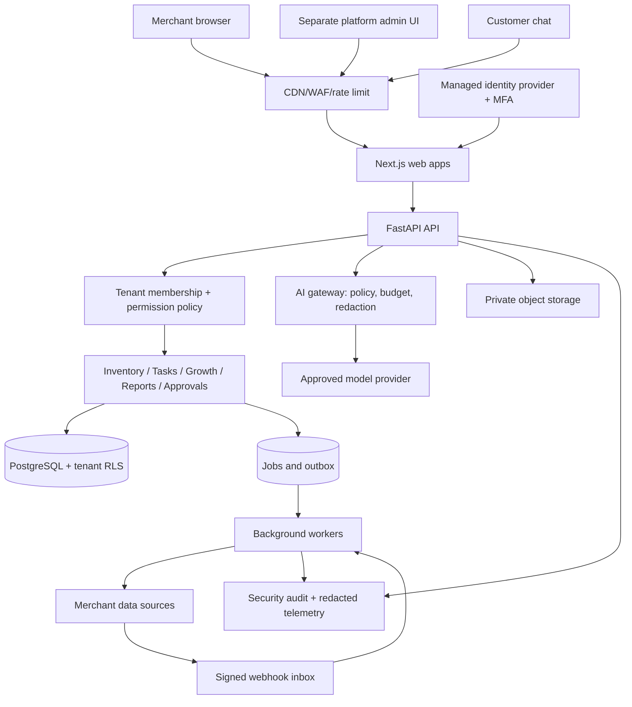

# BizPilot AI Commercial Product Plan

**Status:** Proposed for product-owner review
**Research checked:** 2026-10-08
**Relationship to the current repository:** This plan starts after the restricted Streamlit/SQLite pilot. It does not describe the current prototype as production-ready.

The enforceable staged security baseline and every-push procedure are maintained in [SECURITY_REQUIREMENTS.md](SECURITY_REQUIREMENTS.md).

## 1. Product decision

BizPilot should become a multi-tenant commerce operations product for small Bangladeshi businesses. The first commercial release should make routine inventory, task, customer follow-up, and operating-summary work easier while keeping every business in control of its data and actions.

The product should not expose the original 18 agents as 18 separate applications. Users should see a small number of familiar work areas:

1. **Home** — today's priorities, exceptions, and source freshness.
2. **Products & Inventory** — products, variants, stock, adjustments, and imports.
3. **Customers & Growth** — customer segments and reviewable campaign drafts.
4. **Tasks** — assigned work, due dates, and status.
5. **Reports** — clearly defined operational finance and performance summaries.
6. **Copilot** — natural-language access to the same permitted data and workflows.
7. **Approvals** — exact pending changes, risk, approver, and audit history.
8. **Settings** — business, locations, team, integrations, policies, and billing.

The first commercial release must remain narrow. It should support inventory and task operations, one real data source, read-only business summaries, campaign drafts, approvals, and the Copilot. It should not automatically publish campaigns, change ad budgets, pay suppliers, issue refunds, or make HR decisions.

## 2. Terminology and identity boundaries

Use these terms consistently in code, UI, contracts, and support:

| Term | Meaning |
|---|---|
| **Platform operator** | Our company operating BizPilot. |
| **Platform Admin** | An authorized employee of our company. This is never a merchant role. |
| **Merchant / tenant** | One customer business using BizPilot. Every tenant has an isolated workspace. |
| **Merchant user** | An owner or employee invited to a merchant workspace. |
| **End customer** | A shopper/customer of a merchant. This identity cannot access the merchant dashboard. |
| **Supplier / vendor** | A business supplying products to the merchant. Do not use `vendor` to mean a BizPilot customer. |
| **Connection** | A merchant-authorized integration such as Shopify, WooCommerce, a POS, or a CSV source. |

Authentication answers **who the person is**. Membership and authorization answer **which tenant they may access and what they may do**. Tenant isolation is a separate control that prevents an authenticated user from reaching another merchant's data.

## 3. What current products teach us

This comparison uses official vendor documentation. It identifies established interaction patterns; it does not claim the products are otherwise equivalent.

| Product pattern | Verified market example | BizPilot decision |
|---|---|---|
| Job-based roles instead of raw permission flags for every user | [Shopify roles](https://help.shopify.com/en/manual/your-account/users/roles) provides predefined and custom roles; [Zoho Inventory](https://www.zoho.com/us/inventory/help/settings/users.html) supports roles plus location restrictions. | Start with five understandable merchant roles and fixed permission presets. Add custom roles only after customers demonstrate a need. |
| Separate organization/store scope | [Shopify organization permissions](https://help.shopify.com/en/manual/your-account/users/roles/permissions/organization-permissions) separates organization and store access. [Odoo multi-company](https://www.odoo.com/documentation/19.0/applications/general/companies/multi_company.html) uses company-aware records and access. | A user may belong to multiple tenants, but one explicit active tenant controls each request. Never infer tenant from a user-supplied record ID. |
| Single-item edit plus efficient bulk edit | [Shopify bulk inventory editing](https://help.shopify.com/en/manual/products/inventory/adjusting-inventory/bulk-editing-inventory) and [Square inventory adjustment](https://squareup.com/help/us/en/article/8331-set-up-inventory-tracking) provide focused and bulk workflows. | Provide a simple item form, multi-row bulk editor, and CSV import. Do not make merchants edit database-style tables. |
| Preview and conflict protection for imports | [Shopify inventory CSV](https://help.shopify.com/en/manual/products/inventory/setup/inventory-csv) compares current and new quantities to avoid overwriting newer changes. | Every import gets validation, a before/after preview, conflict detection, an error file, and an explicit Apply step. |
| Inventory changes have reasons and traceability | [Zoho inventory adjustments](https://www.zoho.com/commerce/help/inventory-adjustments/) supports adjustment reasons, locations, draft, and final adjustment. [Odoo inventory adjustments](https://www.odoo.com/documentation/17.0/applications/inventory_and_mrp/inventory/warehouses_storage/inventory_management/count_products.html) records location, counted quantity, date, and responsible user. | Store immutable inventory movements with reason, actor, location, source, before/after quantity, and timestamp. Correct mistakes through reversal, not silent history edits. |
| Sensitive permissions are separated | [Shopify sensitive permissions](https://help.shopify.com/en/manual/your-account/users/roles/permissions/sensitive-permissions) recommends separating high-risk duties. | Finance, team administration, integration credentials, exports, and external actions receive separate permissions and stronger confirmation. |

### Product lesson

The current prototype exposes `inventory_id`, `product_id`, raw JSON payloads, and action names because it is an engineering pilot. The commercial UI should show product name, SKU, variant, location, stock, status, and last updated time. Technical IDs remain available only in a details/debug area for authorized support.

## 4. Roles and permissions

### 4.1 Platform roles operated by us

| Role | Normal access | Prohibited by default |
|---|---|---|
| **Platform Owner** | Platform configuration, staff access, incident controls, billing configuration | Routine browsing of merchant records |
| **Platform Operator** | Tenant status, plan, usage, connection health, job failures, feature flags | Customer messages, full exports, merchant financial rows |
| **Support Agent** | Tenant metadata and redacted diagnostics | Direct database access, secrets, silent impersonation, mutation of merchant data |
| **Security Responder** | Security alerts, session revocation, credential rotation workflows, protected audit evidence | Business operations unrelated to an incident |

Do not build unrestricted support impersonation in R1. If a real support case requires merchant-data access, use a time-limited access request with tenant, reason, approver, scope, expiry, visible banner, and immutable audit event. Emergency access needs a separately monitored break-glass process.

### 4.2 Merchant roles

| Role | Intended permissions |
|---|---|
| **Owner** | Business settings, team invitations, roles, billing, integrations, all tenant reports, and high-risk approvals |
| **Admin** | Day-to-day workspace administration and most business modules; no ownership transfer or platform billing identity |
| **Operations** | Products, inventory, locations, stock adjustments, and operational tasks |
| **Growth** | Customer segments, approved contact fields, content/campaign drafts, and campaign results |
| **Finance Viewer** | Read and export authorized finance reports; no refunds, payouts, team administration, or campaign access by default |
| **Viewer** | Read-only access to specifically assigned modules |

Use permissions behind these presets, for example `inventory.read`, `inventory.adjust`, `inventory.import`, `tasks.manage`, `campaigns.draft`, `finance.read`, `customers.export`, `members.manage`, and `actions.approve`. UI visibility is only convenience; the API must enforce every permission.

### 4.3 End-customer boundary

Customer-facing chat is a different application audience. An anonymous customer may read public catalog and policy information. A verified customer may read only their own orders or requests. Customer tools never include merchant finance, employee, aggregate customer, integration, approval, or platform administration functions.

## 5. Merchant-friendly data management

### 5.1 Replace the raw inventory table

Default inventory columns:

| UI label | Meaning | Editing rule |
|---|---|---|
| Product | Human-readable product name | Edit in product form |
| Variant | Size/color or other options | Edit in variant form |
| SKU | Merchant's business identifier | Required and unique within the tenant when used |
| Location | Shop or warehouse | Select from merchant locations |
| In stock | Recorded physical quantity | Change through Adjust stock |
| Reserved | Quantity committed to open orders | System-managed initially |
| Available | In stock minus reserved | Calculated, never directly edited |
| Low-stock level | Alert threshold | Editable by Operations or Admin |
| Status | In stock, Low stock, or Out of stock | Calculated |
| Last updated | Time and source of latest accepted change | Read-only |

`inventory_id` and `product_id` should not appear in the normal table. Use opaque internal IDs in URLs/APIs and show SKU or product name to users.

### 5.2 Single stock adjustment

The merchant chooses **Adjust stock**, then supplies:

1. location;
2. counted quantity or change amount;
3. reason such as received stock, sale correction, damaged, returned, physical count, or other;
4. optional note/reference;
5. review of old value, new value, and resulting availability;
6. confirmation.

The backend creates an immutable `inventory_movement` and updates the balance in one database transaction. It records tenant, product variant, location, actor, reason, source, idempotency key, and before/after values. Negative stock is blocked by default; an explicit tenant policy may allow it later.

### 5.3 Bulk update and CSV import

The import flow is staged:

1. Download a template or export current inventory.
2. Upload CSV/XLSX within configured size/row limits.
3. Quarantine and parse the file; normalize headers and reject unsupported formulas/content.
4. Match rows by tenant-scoped SKU and location, not a global product ID.
5. Show valid rows, warnings, errors, new records, changes, and unchanged rows.
6. Compare expected current values or record versions to detect concurrent changes.
7. Require an authorized user to apply the exact reviewed batch.
8. Process as a background job and provide progress, error file, and audit record.
9. Allow reversal as a new adjustment batch where safe; never erase the original audit trail.

No model should parse and directly write an uploaded inventory file. Deterministic validators and domain services own the import. AI may explain errors or suggest mappings after the user reviews them.

### 5.4 Real source connections

Each tenant chooses one authoritative source per data domain. Example: Shopify is authoritative for product/order data, while BizPilot owns internal tasks and campaign drafts.

The connector lifecycle is:

```text
Connect with OAuth/API credentials
        ↓
Scope review and test connection
        ↓
Staged initial import with row counts and sample comparison
        ↓
Merchant confirms mapping
        ↓
Incremental events/webhooks → durable inbox → background worker
        ↓
Scheduled reconciliation against the source
        ↓
Freshness and error status shown in the UI
```

[Shopify webhook guidance](https://shopify.dev/docs/apps/build/webhooks) states that deliveries can be duplicated, arrive out of order, or be missed, and recommends signature verification, deduplication, timestamps, and reconciliation jobs. BizPilot must implement those properties for every connector, even when another provider uses different header names.

Every connector displays:

- source name and connected account;
- granted scopes;
- last successful sync and last event time;
- data domains and source-of-truth direction;
- warning when data is stale;
- reconnect, pause, reconcile, and disconnect actions;
- effect of disconnect and retention/deletion options.

Manual edits to connector-owned fields are either pushed back through the connector or clearly stored as an approved local override. Silent last-write-wins behavior is not acceptable.

## 6. User experience that stays understandable

### 6.1 First-run onboarding

A progress checklist replaces an empty technical dashboard:

1. Create business workspace: name, timezone, currency, and language.
2. Add first location.
3. Invite team and assign preset roles.
4. Add products manually, import a file, or connect the selected source.
5. Verify sample counts and source freshness.
6. Choose which AI features are enabled and what data may be sent to the model provider.
7. Run a guided read-only Copilot question.
8. Review and approve a harmless internal task proposal.

Users can skip nonessential steps and return later. Each error explains what happened, whether anything changed, and the safe next action.

### 6.2 Home page

The first page should answer four questions:

- Is my data connected and fresh?
- What requires attention today?
- Which actions are awaiting approval?
- What changed recently?

Recommended cards: low-stock items, overdue tasks, sync warning, pending approvals, and today's clearly labelled sales/expense snapshot. Raw tables remain behind **View details**.

### 6.3 Approvals

Replace internal action names and JSON with a human summary:

```text
Create 4 restock review tasks

Why: 4 variants are at or below their low-stock levels.
Effect: Creates internal tasks only. No order or payment will be made.
Requested by: Rahim Ahmed
Expires: 10 Oct 2026, 17:00 Asia/Dhaka

[Review 4 items]  [Approve]  [Reject]
```

The detail drawer may show the exact immutable payload, proposal ID, source versions, and audit hash. Approval becomes invalid if relevant data, actor permission, recipients, amount, connection, or policy changed after proposal creation.

### 6.4 Copilot behavior

The Copilot should:

- state the tenant, date range, source, and freshness behind business answers;
- link to the relevant product, task, customer segment, or report;
- ask for missing business information rather than invent it;
- produce proposals for writes and route them through the same backend permissions;
- show whether an answer is deterministic data, a model-generated explanation, or a recommendation;
- keep Bangla, Banglish, and English support with reviewed examples.

Structured inventory, orders, balances, permissions, and approval state come from SQL/API services. RAG is for tenant-approved documents such as SOPs, return policies, product manuals, and FAQs. It is not the source of truth for stock or money.

## 7. Production architecture

Use a modular monolith for R1. This keeps operations manageable while preserving clear domain boundaries.



### Recommended R1 stack

| Layer | Choice |
|---|---|
| Merchant and admin UI | Next.js + TypeScript; accessible component library; TanStack Query/Table; React Hook Form + Zod |
| API | FastAPI + Pydantic |
| Data access | SQLAlchemy 2 + Alembic |
| Database | Managed PostgreSQL with backups/PITR and Row-Level Security |
| Authentication | Managed OIDC authentication; keep tenant memberships and business permissions in BizPilot |
| Jobs | PostgreSQL outbox/job state plus Celery and managed Redis initially |
| Object files | Private S3-compatible storage with short-lived signed downloads |
| AI | Provider adapter around Gemini/OpenAI; tenant-approved provider and per-tenant usage budget |
| Observability | Structured redacted logs, OpenTelemetry traces/metrics, error monitoring, protected audit stream |
| Delivery | Docker, GitHub Actions, staging promotion, migration job, immutable release artifacts |

The existing Streamlit application remains a fictional demo and reference for deterministic domain behavior. It must not become the multi-tenant production UI merely by adding more forms.

## 8. Tenant isolation and security baseline

### 8.1 Mandatory isolation controls

Every tenant-owned table includes `tenant_id`. Child records use tenant-scoped foreign keys. API queries, background jobs, cache keys, exports, file paths, search indexes, AI context, and audit queries all carry verified tenant context.

Use PostgreSQL RLS with default-deny policies and a restricted runtime role. PostgreSQL documents that table owners and `BYPASSRLS` roles can bypass normal row policies, so the application runtime must not connect as owner and critical tables should use `FORCE ROW LEVEL SECURITY` where appropriate: [PostgreSQL row security](https://www.postgresql.org/docs/current/ddl-rowsecurity.html).

RLS is defense in depth. Each endpoint also verifies membership, permission, and object ownership. OWASP lists missing object-level authorization as a leading API risk: [OWASP API Security Top 10](https://api-security.owasp.org/editions/2023/en/0x11-t10/). AWS also distinguishes ordinary authentication/authorization from explicit tenant isolation: [AWS multi-tenant authorization guidance](https://docs.aws.amazon.com/prescriptive-guidance/latest/saas-multitenant-api-access-authorization/introduction.html).

### 8.2 Authentication and session controls

- Use a managed identity provider; do not implement password storage.
- Require MFA for Platform Admins and Merchant Owners before production access.
- Require recent reauthentication for ownership transfer, integration-secret changes, large exports, team/role changes, and destructive actions.
- Use secure, HTTP-only, same-site cookies; short-lived access tokens; rotation/revocation; exact redirect URLs; and CSRF protection for cookie-authenticated mutations.
- Validate token signature, issuer, audience, expiry, nonce/state, and tenant membership server-side.
- Recheck permissions when an action executes; approval from a user whose role was revoked must fail.
- Rate-limit login, recovery, invitations, exports, AI calls, imports, and action confirmation by identity, tenant, and IP/risk signal.

### 8.3 Data and secret protection

- TLS in transit and managed encryption at rest.
- Secrets in a managed secret store, separated by environment and connector; never in source, model prompts, logs, browser storage, or support screenshots.
- Rotate and revoke secrets; record ownership, purpose, dependency, and last rotation. Follow [OWASP secrets management guidance](https://cheatsheetseries.owasp.org/cheatsheets/Secrets_Management_Cheat_Sheet.html).
- Store only data required for the product. Define tenant-visible retention, export, deletion, and legal-hold behavior before real onboarding.
- Redact tokens, credentials, session IDs, personal data, message bodies, and financial detail from default logs. OWASP identifies authentication data, keys, connection strings, payment data, and sensitive personal data as values that should not be logged directly: [OWASP logging guidance](https://cheatsheetseries.owasp.org/cheatsheets/Logging_Cheat_Sheet.html).
- Encrypt connector credentials with a key-management service and restrict decryption to the connector worker identity.
- Production, staging, demo, and CI use separate data, credentials, identity projects, and model keys.

### 8.4 File/import defenses

- Enforce extension, MIME, size, row, column, and decompression limits.
- Store uploads in quarantine with random object names; malware scan before processing.
- Neutralize spreadsheet formulas on export and reject dangerous formula-bearing import cells where formulas are unsupported.
- Parse with bounded memory/time and background jobs; never evaluate macros.
- Tenant-scope every import, preview, error file, and signed download.
- Audit upload, validation, apply, export, and delete events.

### 8.5 AI-specific defenses

- Treat user text, imported files, retrieved documents, connector content, and model output as untrusted.
- The model receives no database credentials or broad API tokens.
- Backend code selects permitted tools; prompt text cannot grant a permission.
- Validate tool arguments, tenant scope, record state, and policy before every read/write.
- Use minimal field projections; avoid sending full customer/product tables.
- Require exact-payload approval for external messages, purchases, refunds, price/budget changes, destructive changes, or bulk exports.
- Apply per-tenant cost and concurrency limits and protect expensive business flows from automated abuse.
- Maintain provider-specific data-processing settings and tenant consent. Do not silently send a tenant's data to a fallback provider.

### 8.6 Secure development gate

Use OWASP ASVS 5.0 as the verifiable application-security baseline, with a reviewed Level 2 profile for the commercial web application: [OWASP ASVS](https://owasp.org/projects/asvs). The label is a requirements target, not a certification claim.

Required pipeline and release controls:

- code review and protected branches;
- dependency lockfiles, vulnerability audit, secret scan, SAST, container scan, and SBOM;
- tenant isolation, authorization, CSRF/XSS, injection, rate-limit, file-upload, and session tests;
- DAST against staging;
- database and object restore drill;
- external penetration test before broad real-data availability and after material identity/isolation changes;
- incident runbooks for credential leak, tenant-leak suspicion, provider abuse, webhook forgery, data corruption, and cost spike.

No security control provides a guarantee that an attack will never happen. The goal is to reduce likelihood and blast radius, detect misuse quickly, and recover with evidence.

## 9. Data model additions

Minimum production entities:

```text
tenants
users
memberships
role_permissions
locations
products
product_variants
inventory_balances
inventory_movements
customers
orders / order_items
tasks
campaigns
action_proposals / action_approvals / action_executions
connections / connection_scopes
source_mappings / sync_cursors / sync_runs / webhook_inbox
imports / import_rows / import_errors
audit_events
usage_ledger / budget_reservations
```

Important constraints:

- IDs may be UUID/ULID, but unpredictable IDs do not replace authorization.
- Product SKU uniqueness is tenant-scoped and may also be location/source aware where required.
- Source mappings are unique by tenant, connection, entity type, and external ID.
- Inventory balance is unique by tenant, variant, and location.
- Webhook delivery and import application use idempotency keys.
- Money uses integer minor units plus currency; quantities use an explicit unit/precision policy.
- Optimistic record versions prevent a stale form/import from overwriting a newer value.
- Audit events record actor, tenant, authority, operation, target, before/after reference, outcome, IP/session context, and time without storing secrets.

## 10. Commercial R1 scope

### Must ship

- Tenant onboarding and workspace switcher.
- Managed login, MFA for privileged roles, invitations, role assignment, revocation, and session termination.
- Product/variant/location management with friendly labels.
- Single inventory adjustment, immutable movement history, search/filter, and low-stock rules.
- Staged CSV import/export with preview, conflict detection, errors, and audit.
- One real commerce/POS connector chosen from pilot-customer evidence.
- Tasks, assignment, due date, status, and source links.
- Read-only, clearly defined operating summary.
- Copilot over permitted structured data with sources/freshness.
- Exact-action proposal/approval flow for internal tasks and campaign drafts.
- Platform operations console with redacted tenant/connection/usage health.
- Audit view, usage limits, backup/restore, monitoring, and incident controls.
- English, Bangla, and Banglish core journeys.

### Should ship if R1 remains stable

- Saved views and low-stock notification preferences.
- Reversible bulk inventory adjustment.
- Merchant-visible audit export.
- Read-only customer segmentation and campaign draft templates.
- Simple dashboard customization by role.

### Later releases

- Actual campaign sending and channel inbox.
- Supplier purchase requests and procurement comparison.
- Payment/refund actions, full accounting, and cash-flow forecasting.
- Ads/SEO connectors and controlled publishing/budget actions.
- RAG over approved merchant documents.
- Custom merchant roles, enterprise SSO/SCIM, and dedicated tenant databases.
- HR/recruitment/performance modules after a separate privacy and employment-domain review.

## 11. Edge cases that must be designed and tested

### Identity and tenant

- Same email belongs to two merchants; each browser tab has an explicit active tenant.
- Invitation sent to the wrong address; owner can revoke before and after acceptance.
- Last owner cannot be removed without a reviewed ownership-transfer flow.
- Role revoked while a user has an open tab or pending approval.
- Support case expires while support is viewing a record.
- Suspended tenant cannot use API tokens, background jobs, exports, or AI calls.

### Inventory and imports

- Same SKU exists in different tenants or intentionally in different sources.
- Two staff adjust the same item concurrently.
- CSV was exported, stock changed through sales, then the old CSV is re-imported.
- Duplicate rows, unknown locations, decimal/negative quantities, encoding problems, Bangla headers, and oversized files.
- Import partially fails or worker restarts after commit.
- Item is deleted/archived upstream while an approval refers to it.
- Connector event arrives twice, out of order, or after a reconciliation snapshot.

### Approvals and AI

- Proposal data changes after review.
- Two people click Approve together.
- Approver lacks the required permission at execution time.
- Model asks for a tool outside the actor's permission.
- Retrieved document contains prompt-injection instructions.
- Provider times out after accepting a request; external state is unknown.
- Tenant reaches budget, provider quota, or rate limit while deterministic dashboards remain available.

### Privacy and operations

- Tenant requests export/deletion while accounting/audit retention may differ.
- Secret appears in a user-uploaded file or provider error.
- Backup restores database metadata but misses object files.
- Logs or analytics accidentally receive customer text.
- One tenant creates enough imports or AI calls to degrade other tenants.

## 12. Delivery plan

The planning range is **14–18 weeks for a controlled R1 pilot** with three full-time engineers plus fractional product, QA, security, and domain review. A solo developer should reduce scope and expect a longer schedule. External connector approval and poor source data can extend the timeline.

| Phase | Indicative time | Deliverables | Exit gate |
|---|---:|---|---|
| **0. Merchant discovery and product contract** | 1–2 weeks | Interview 3–5 target merchants; choose one vertical and source; map inventory workflow; agree terms, data ownership, metric definitions, support model, and success measures | Signed pilot scope and representative sanitized data samples |
| **1. Tenant/security foundation** | 3 weeks | Next.js shell, FastAPI, managed identity, memberships/roles, PostgreSQL schema/RLS, platform-admin separation, audit, environment separation, CI security gates | Two-tenant adversarial suite returns zero cross-tenant data/actions; restore test succeeds |
| **2. Human data management** | 3 weeks | Product/location UI, inventory movements, single/bulk update, staged import/export, tasks, source/freshness fields | Merchant can complete core flow without AI; concurrency/import/reversal tests pass |
| **3. One reliable connector** | 2–3 weeks | OAuth/credential flow, scoped tokens, backfill, webhook inbox, idempotent workers, reconciliation, stale/error UI | Duplicate/out-of-order/delete/retry fixtures converge to source truth |
| **4. Copilot and approvals** | 2–3 weeks | Tenant-scoped read tools, links/evidence, budget ledger, internal proposals, approval expiry/recheck, multilingual evaluation | Grounded-answer and tool-use gates pass; zero unauthorized writes in adversarial tests |
| **5. Controlled pilot launch** | 3–4 weeks | Shadow mode, onboarding, runbooks, monitoring, support process, DAST/penetration findings addressed, rollback and incident drill | 3–5 merchants sign off after measured pilot; no unresolved critical/high release finding |

Do not schedule all 18 capabilities inside this R1 range.

## 13. Practical implementation order

1. Freeze R1 terminology, role matrix, source of truth, and threat model in architecture decisions.
2. Create `apps/web` and `backend` beside the current demo; do not rewrite working deterministic rules first.
3. Add PostgreSQL migrations for tenants, memberships, roles, audit, products, variants, locations, balances, and movements.
4. Implement managed-auth token validation, active-tenant resolution, backend permissions, restricted DB role, and RLS.
5. Prove isolation with API, direct repository, worker, cache, export, and object tests using two tenants.
6. Build product/location/inventory UI and deterministic APIs before connecting AI.
7. Build import staging, conflict checks, background application, and reversal.
8. Add one connector using signed/idempotent webhook intake plus scheduled reconciliation.
9. Port the prototype's deterministic inventory, task, and finance definitions behind tenant-aware services.
10. Add Copilot read tools, minimal context, evidence links, budget ledger, and proposal/approval controls.
11. Add Platform Admin health UI with metadata only and the governed support-access workflow.
12. Complete staging browser, security, recovery, load, connector, multilingual, and merchant acceptance gates.

## 14. Acceptance criteria for the commercial pilot

### Usability

- A new merchant can create a workspace, location, first product, and stock adjustment without seeing internal IDs.
- A merchant can import inventory, understand every rejected row, preview changes, and safely apply or abandon the batch.
- Every important screen explains data source and freshness in plain language.
- A user can understand an approval's purpose and effect without reading JSON.
- Core journeys work on common mobile and desktop widths and support Bangla text input/display.

### Authorization and isolation

- Every API/worker/export/object/RAG path has tenant and permission tests.
- Changing an object ID, tenant claim, cache key, or job payload cannot expose or modify another tenant.
- Platform support sees redacted metadata by default; temporary data access is approved, scoped, expiring, visible, and audited.
- Revoked membership/session loses access promptly and cannot execute an old proposal.

### Data reliability

- Inventory updates are transactional, attributable, idempotent, and reversible through a new movement.
- Stale imports cannot silently overwrite newer stock.
- Connector retry, duplicate, out-of-order, deletion, and outage recovery converge to the agreed source of truth.
- The UI blocks or warns on commitments when required source data is stale.

### AI and actions

- Deterministic services calculate stock and money; the model explains and orchestrates within permission.
- Every write is validated in backend code and sensitive writes require a current exact-payload approval.
- Provider failure does not remove inventory, tasks, reports, or approvals.
- Model/provider usage is metered per tenant with hard limits and no unapproved fallback provider.

### Operations and security

- CI includes tests, migration validation, secret/dependency/SAST/container scans, and immutable builds.
- Staging passes DAST, restore, rollback, incident, and representative load exercises.
- No unresolved critical/high finding affects an enabled production path.
- Alerts cover authentication anomalies, permission failures, webhook verification, sync lag, job backlog, provider failures, error rate, latency, and tenant cost spikes.

## 15. Pilot success measures

Set targets with pilot merchants before launch; do not invent ROI after deployment. Measure:

- time to first verified inventory dataset;
- percentage of imports completed without support and time to fix failed rows;
- inventory freshness and source-to-BizPilot reconciliation error;
- daily/weekly active merchant users by role;
- tasks and proposals accepted, edited, rejected, and completed;
- merchant correction rate for Copilot answers;
- handoff/support minutes per tenant;
- p95 non-AI and AI response latency;
- provider/infrastructure cost per active tenant and resolved interaction;
- security, privacy, and cross-tenant incidents.

A successful pilot proves a useful, supportable, and isolated workflow for a small group of merchants. It does not prove readiness for every industry, all 18 capabilities, or unrestricted automated actions.

## 16. Decisions required before implementation

The Product Owner should approve these in order:

1. First merchant vertical and real source: for example Shopify fashion merchants, WooCommerce merchants, or CSV-first retailers.
2. R1 roles and whether Finance Viewer is included in the first pilot.
3. Managed identity and hosting vendors after region, backup, MFA, organization, and cost review.
4. Source-of-truth rules for product, inventory, order, and customer fields.
5. Production model provider/data-processing terms and which tenant fields may be sent.
6. Pilot retention/export/deletion policy and support-access policy.
7. Paid pilot price, onboarding responsibility, support hours, and success measures.

After these decisions, implementation should begin with Phase 0/1 and stop at the tenant-isolation security checkpoint before real merchant data is accepted.
