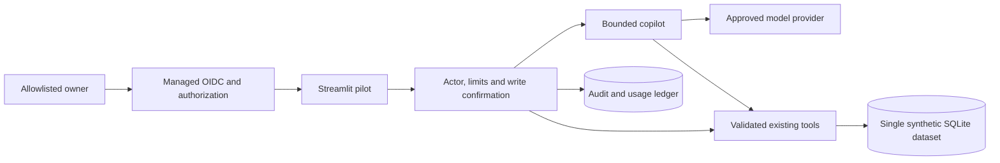
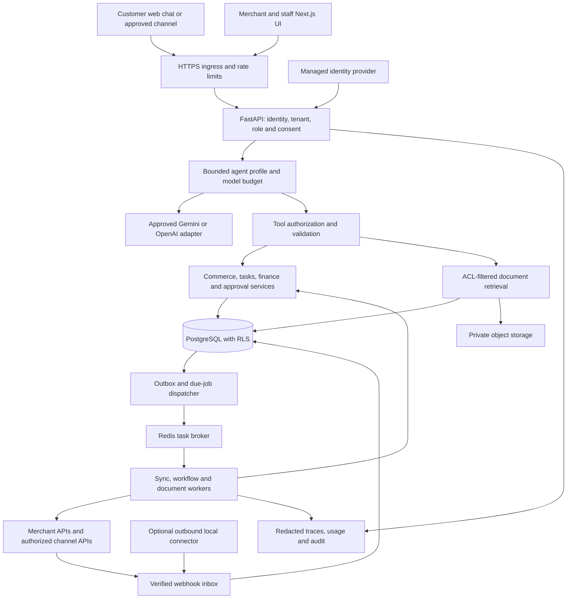
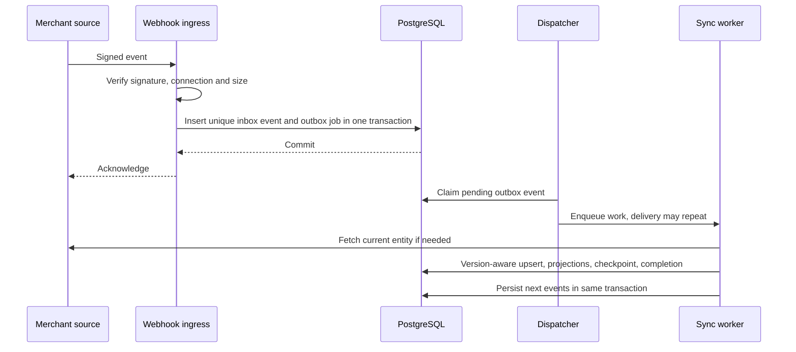

# BizPilot AI: Production Architecture and Delivery Plan

Original architecture research: **2026-09-29**. Code, requirements and market review: **2026-10-04** at commit `1e6eb75`. Status: **proposed implementation plan**, not a statement that these production capabilities already exist.

**Immediate delivery decision:** a 2–3 day sprint can harden the existing owner-facing prototype into a restricted, synthetic-data evaluation pilot. It cannot complete the 18-capability production platform. Section 0 defines that release, its market rationale and requirements. [THREE_DAY_TODO.md](THREE_DAY_TODO.md) contains the executable work checklist and test gates. Sections 1–23 retain the full production path; their multi-tenant architecture and estimates apply to R1 and later, not the three-day release.

This document turns the original 18-capability vision into a staged product for Bangladeshi SMEs. It uses the current repository, `PRODUCT_BRIEF.md`, and primary vendor/security documentation. Technical decisions, capacity targets, timelines, and budget allowances are our engineering proposals. They are distinguished from documented provider facts and have to be validated during the pilot.

Navigation:

- [Current review and sprint scope](#0-october-review-requirements-and-immediate-release) and [2–3 day TODO](THREE_DAY_TODO.md)
- [Scope and assumptions](#1-decision-and-planning-assumptions)
- [All 18 capabilities](#3-how-the-18-capabilities-become-a-product)
- [Architecture](#4-architecture-decision-and-alternatives) and [stack](#5-recommended-stack-and-deployment-options)
- [Tenant identity](#6-tenant-and-consumer-identity-model) and [database isolation](#7-database-design-and-isolation)
- [Data synchronization](#8-getting-updated-customer-data-reliably) and [low-cost updates](#9-keeping-updates-and-storage-inexpensive)
- [RAG and memory](#10-business-memory-rag-and-fine-tuning)
- [Safe actions](#11-model-orchestration-and-safe-actions) and [security](#12-security-privacy-and-trust-boundaries)
- [Cost calculations](#13-api-and-operating-cost-model)
- [Reliability](#15-reliability-observability-and-incident-response) and [test gates](#16-test-strategy-and-release-gates)
- [Implementation roadmap](#17-implementation-plan-ownership-and-dependencies) and [deployment pipeline](#19-delivery-pipeline-local-development-to-deployment)
- [Evidence comparison](#22-evidence-comparison-and-unresolved-decisions) and [source register](#23-source-register)

## 0. October review, requirements and immediate release

### 0.1 Review coverage and measured baseline

Read all application Python modules, all eight test modules and their fixture, the launcher, dependency declarations, Git ignore rules, evaluation cases, README, product brief, prototype overview, repository guidance and this plan. Environment-template setting names were inspected with values redacted. Credentials, virtual environments, generated database contents and the generated PDF were excluded. There is one repository `AGENTS.md`; its prototype implementation boundary remains relevant. This review updates planning documents only.

On 2026-10-04, `powershell -ExecutionPolicy Bypass -File .\run.ps1 -CheckOnly` passed **16 tests in 2.84 seconds**. No live inference was performed for this review. The 26 JSON language cases are manual evaluation inputs, not 26 additional passing tests. There is no automated deployed-browser, authentication, provider-failure, or multi-tenant test suite today.

| File/group reviewed | Implemented behavior | Finding and release implication |
|---|---|---|
| `app.py:19`, `database/db.py:84` | Automatic schema/fictional-data initialization | No login or role checks before any business access. Add an entry gate and explicit deployment/data mode. Never reinterpret a seeded database as a real merchant source. |
| `agent.py:162` | SDK execution, 11 tools, eight-turn ceiling | No application deadline, input/history/result limits, cost admission or actor authority. A turn ceiling alone does not bound all tool calls or total spend. |
| `agent.py:165`, `config.py` | Gemini tracing disabled; default OpenAI mode | Review tracing in every mode; default to no payload tracing for the pilot. Make provider errors provider-specific and validate configuration at startup. |
| `tools/operations.py`, `database/models.py` | Parameterized inventory queries; validated tasks | Result sets are unbounded. A task's polymorphic entity ID has no foreign key or existence check; positive ID validation does not prove a real inventory item exists. |
| `workflows/inventory_workflow.py` | Transaction and unique index prevent duplicate open restock rows | Existing tests repeat sequentially. Concurrent workflows may hit locking/constraint errors; test parallel execution and return a safe retryable result, preserving uniqueness. |
| `tools/growth.py:25` | Inactivity query and persisted draft | `objective` is returned but not persisted. General campaign retries create additional drafts; add logical-request idempotency if writes remain enabled. |
| `tools/finance.py:29` | Sums received amounts on orders selected by order date | This is order-cohort collection, not cash received during that calendar period. A payment on an older order cannot be dated correctly. Relabel now; payment-event accounting is later. Receivables are also cohort-scoped, not the entire outstanding balance. |
| `services/business_summary.py:16` | Aggregate priorities plus inactive customer list | Owner summary sends names/preferences unnecessarily. Return counts and bounded evidence by default. |
| `offline_demo.py` | Rules over the same database; can create drafts/tasks | Offline is not a security boundary. Apply the same access/write gates. Some unsupported date requests become today's response; explicitly state supported scope. |
| `database/seed.py` | Serialized first-run seed using `BEGIN IMMEDIATE` | Covered by four-thread seed test. Do not generalize this result to every write workflow or cloud durability. |
| `tests/*.py`, `evals/*` | Deterministic demo regression and manual language prompts | Add independent fixed finance fixtures: the current finance test repeats the implementation's SQL definition and cannot detect the payment-date semantic gap. |
| `requirements.txt`, `run.ps1`, `.gitignore` | Broad package ranges; install/seed/test launcher | Lock tested dependencies for releases. Launcher is a development command. Ignore `.streamlit/secrets.toml` before adding OIDC; scan without printing secret matches. |
| `README.md`, `prototype-v1.md`, `PRODUCT_BRIEF.md` | Demo instructions and larger vision | Prototype overview says 15 tests and implies hallucination prevention. Update in sprint: 16 baseline tests, measured language quality only, no guaranteed factuality. No fine-tuning is implemented. |

These findings combine code inspection and the existing regression run. Potential concurrency/failure paths are test requirements, not claims that a deployed exploit was reproduced.

### 0.2 Current market comparison

Official pages checked **2026-10-04**. The table describes vendor-documented offerings, not independently measured quality, security, Bangla support or account eligibility. Product trials and merchant interviews are still required.

| Offering | Documented overlap | What BizPilot currently lacks | Product decision |
|---|---|---|---|
| [Shopify Sidekick](https://help.shopify.com/en/manual/ai-powered-tools/sidekick) | Store-context assistance, content/tasks, recommendations, review before changes, memory and background work | Real store context, persistent workflows and review UI | Generic owner chat and recommendations are established features. Validate demand among merchants with local/POS/mixed sources. |
| [Gorgias](https://www.gorgias.com/ai-agent) | Ecommerce customer experience, helpdesk and commerce-platform integrations | Customer inbox, connectors and handoff | Do not claim support-agent parity from an owner dashboard. Compare on the merchant's actual channel/source. |
| [Intercom / Fin](https://www.intercom.com/pricing) | Customer support, external-system actions and human handoff; pricing shown from $0.99 per Fin outcome, with additional plan/channel conditions | Outcome tracking, customer identity and support operations | Measure task completion and support effort. Token cost alone is not a fair comparison with a complete service price. |
| [Zoho Zia Agents](https://www.zoho.com/agents/) | Prebuilt agents and a studio across its business-app ecosystem | Integrated CRM/operations data and configurable workflows | Eighteen agent names are not a defensible advantage. Build a narrow workflow with reliable data. |
| [HubSpot Agent Hub](https://www.hubspot.com/products/artificial-intelligence) | AI agents alongside CRM, sales, marketing and service products | Shared customer records, onboarding and mature business workflows | Evaluate integration or complementing existing systems before trying to replace an entire business suite. |

Cross-check: Shopify's detailed help documentation and Zoho/HubSpot product pages independently show contextual business assistance is already offered. Intercom and Gorgias show customer service requires surrounding inbox/integration operations. This supports prioritizing data, workflow completion and handoff over agent count. It does **not** establish equivalent functionality or quality between vendors.

**Positioning hypothesis:** a merchant can ask natural Banglish questions over their permitted local commerce data, understand source freshness, and get a useful reviewable next action with predictable cost. Banglish quality, affordable onboarding and local data compatibility must be tested; this review does not establish that competitors lack them. No market-size, revenue-lift or superiority claim is supported yet.

Discovery: interview three merchants; record their source systems, ten recurring questions, current workaround/time, permission needs and willingness to pay. Run the same ten permitted synthetic tasks in an available incumbent trial or observe a merchant's existing tool. Score accuracy, setup time, correction effort, handoff and total cost. If the incumbent solves the problem adequately, narrow BizPilot to the missing workflow or sell integration/service rather than duplicate the suite. Account access and interviews can extend beyond this sprint.

### 0.3 Requirement analysis and traceability

Personas: merchant owner first; staff and verified end customers later. The immediate user journey is login → inspect a dated synthetic dataset → ask inventory/priority questions → inspect evidence → explicitly create an internal draft/task → verify the committed result. A customer-facing agent is a separate release because it must never inherit owner tools.

| ID | Requirement / acceptance | Priority | Sprint ticket | Full phase |
|---|---|---|---|---|
| RQ01 | One allowlisted owner identity; unauthorized sessions cannot read data or invoke AI/tools | Must for hosted pilot | D1-2 | B |
| RQ02 | Explicit fictional dataset label/version; no auto-seed outside demo | Must | D1-3 | B–C |
| RQ03 | Every finance label matches its dated metric; no claim of period cash flow without payment events | Must | D1-4 | A, C |
| RQ04 | Bounded input/history/results, deadline, concurrency and persisted cost admission | Must for AI pilot | D2-1 | E |
| RQ05 | Draft-only actions; backend checks, replay protection, actor audit and explicit confirmation | Must if writes enabled | D2-2 | B, D |
| RQ06 | English/Bangla/Banglish evidence-based responses; unsupported requests abstain | Must for AI pilot | D2-3 | E |
| RQ07 | Deployed auth, state persistence, failure, restore and browser tests pass | Must for hosted pilot | D3-1/2/3 | F |
| RQ08 | One approved real source, validated mappings, freshness and reconciliation | Must before real-data R1 | Deferred | A–C |
| RQ09 | Tenant/role/customer isolation across tools, jobs, cache and documents | Must before shared SaaS/customer access | Deferred | B–E |
| RQ10 | Customer lead/draft order and human handoff end to end | Must for canonical commerce V0/R1 | Deferred | D |
| RQ11 | RAG over approved documents with ACL/version/deletion tests | Should when document demand exists | Deferred | E/R2 |
| RQ12 | Retention/campaign delivery, procurement, payments and People workflows | Later, domain-specific gates | Deferred | R2–R4 |

RQ08–RQ10 are not waived by calling the sprint a pilot. The sprint does not meet the canonical product brief's customer-sales V0 definition. It prepares a smaller owner evaluation release and reusable safety controls.

### 0.4 Three-day architecture and release boundary

Keep Python, Streamlit, SQLite, Pydantic and the existing SDK. Add managed OIDC with a server-side owner allowlist, a shared policy/limits wrapper, minimal audit/usage tables, and explicit data-mode configuration. No Next.js/FastAPI migration, Redis, vector database or new external business connector in this sprint.



[Streamlit documents OIDC authentication](https://docs.streamlit.io/develop/concepts/connections/authentication), including that authentication does not supply authorization and logout does not invalidate other already-open sessions. Use verified identity plus a server-side allowlist and recheck authorization before actions. Add session expiry/revocation tests; merely hiding tabs is insufficient. The exact Streamlit/auth dependencies must be pinned after verifying compatibility.

Primary release target: one deployment, one synthetic merchant, two named evaluators maximum, one process, no external sends or financial commitments. SQLite must be on a persistent local disk for saved pilot actions; use SQLite's backup API and a tested restore. This is not horizontal scaling or multi-tenancy. If persistent hosting is unavailable, ship a disposable synthetic read-only demo and label reset behavior explicitly. Real customer data remains blocked until source permission, storage/privacy, isolation and recovery requirements are separately reviewed.

Security requirements are consistent with [OWASP agent guidance](https://cheatsheetseries.owasp.org/cheatsheets/AI_Agent_Security_Cheat_Sheet.html): backend authority and bounded tool access matter even when prompts request good behavior. Recheck [Gemini terms](https://ai.google.dev/gemini-api/terms) before real records reach inference; the synthetic sprint does not establish approval for personal data processing. Previously shared credentials must be rotated before reuse in any hosted release, without copying them into reports.

**Capacity assumption:** two experienced engineers × three eight-hour days = 48 person-hours, including tests/review and buffer. Owner provides decisions and a short acceptance session. Two days = 32 person-hours: cut draft mutations and hosted release first, retaining local/read-only evaluation and its gates. A solo developer has only 16–24 hours: finish a smaller local hardening milestone, not the same release by dropping tests. Unknown auth/hosting access, API eligibility or failed gates move the release date.

Full multi-tenant R1 retains sections 1–23, including the 14–18 week planning range subject to discovery. The sprint precedes phase A; it neither compresses that range into three days nor consumes all its deliverables. Carry shared policy interfaces, regression fixtures, metric definitions and evaluation evidence forward; replace SQLite and Streamlit as the full workflow requires.

## 1. Decision and planning assumptions

Build a **tenant-aware business platform with bounded AI workflows**, starting with commerce. Keep the 18 agent names as product capabilities. Implement them over shared services, data contracts, permissions, and background jobs. Do not create 18 services or run 18 model conversations for every user request.

The first production slice should connect one merchant data source, answer customer product questions, create draft leads/orders, and give the owner verified inventory and business-priority information. Follow-up sending needs explicit policy and approval. Add the other capabilities only after their data and authorization requirements are met.

Working assumptions, to confirm in discovery:

| Area | Planning assumption | Consequence if different |
|---|---|---|
| Initial market | Small commerce businesses in Bangladesh | Services businesses may justify appointments before inventory |
| Pilot | 3–5 merchants; 10,000 resolved conversations/month in the cost example | Resize after measuring actual traffic |
| Conversation definition | A business interaction containing about four user messages | Billing must count turns, tokens, and retries separately |
| Team | Three full-time engineers plus fractional product/domain, QA, and security help | A solo developer needs a substantially smaller scope and longer schedule |
| Initial channel | Web chat; one commerce source selected from pilot customers | Meta review may run in parallel, not block the first web pilot |
| Service expectation | Business-hours pilot support; no 24/7 contractual SLA initially | Round-the-clock support requires staff and additional infrastructure |
| Data | Merchant-owned structured records and approved documents | Highly sensitive or residency-restricted data needs a separate deployment decision |
| Language | English, Bangla, Banglish | Evaluate local expressions; do not assume multilingual quality |
| Budget | Paid production services with usage limits | Free quotas are for demonstrations, not a production business model |

"Consumer-based agent" is interpreted in two ways: each merchant gets its own configuration, data boundary, and entitlements; each end customer gets a restricted customer-facing assistant. The latter must never inherit the owner's financial or employee access.

## 2. What exists, and what must change

The repository currently has a Streamlit interface, one Agents SDK copilot with 11 business tools, Gemini/OpenAI modes, a rule-based offline mode, SQLite tables, deterministic finance and inventory logic, and a restock workflow. The latest `run.ps1 -CheckOnly` run on **2026-10-04** passed **16 tests**. These tests do not establish production security, concurrency capacity, or multilingual model accuracy.

| Existing component | Reuse | Production work |
|---|---|---|
| `app.py` | Product interactions and dashboard concepts | Move customer/merchant UI to Next.js; Streamlit can remain an internal demo |
| `agent.py` | Instructions, tool definitions, provider experience | Split provider adapter, agent profiles, authorization, execution, and usage metering |
| `tools/operations.py` | Inventory/task rules | Tenant context, warehouse/variant identifiers, transactions and source freshness |
| `tools/growth.py` | Inactivity and draft-campaign concept | Consent, identity resolution, segments, delivery state, attribution |
| `tools/finance.py` | Deterministic calculations | Merchant-approved metric definitions, currency handling, refunds and reconciliation |
| `services/business_summary.py` | Aggregated fact retrieval | Role-filtered evidence, timestamps, freshness and bounded result sizes |
| `database/db.py` | Table relationships as a starting point | PostgreSQL, migrations, RLS, scoped keys, indexes and connection pooling |
| `database/seed.py` | Synthetic fixtures | Explicit demo/test command only; production startup must never seed fictional customers |
| `workflows/inventory_workflow.py` | Idempotent task creation | Persisted workflow state, worker execution, monitoring and permissions |
| `config.py` | Configuration separation | Typed startup settings, secret references, approved provider/model registry |
| `offline_demo.py` | Demo and testing | Never silently replace a failed real business answer with demonstration data |
| `tests/`, `evals/` | Regression suite and initial cases | Real PostgreSQL isolation tests, connector replay, security and model evaluations |
| `run.ps1` | Local development convenience | Container builds and CI/CD deployment pipeline |

Correct earlier simplifications: tool calling reduces opportunities to invent facts but cannot guarantee a model will never hallucinate. A local database connected to a hosted model can still send retrieved data to the model provider. The SQLite startup lock fixed one race; it did not add tenant isolation or reliable cloud persistence. This prototype does not fine-tune Gemini.

## 3. How the 18 capabilities become a product

Use the original five logical roles from `PRODUCT_BRIEF.md` as orchestration profiles: Customer & Sales, Follow-up & Retention, Business Analyst, Next Action, and Owner Advisor. Add specialist profiles only when an evaluated workflow needs different permissions or instructions. The following rollout labels apply throughout this plan:

- **R1:** controlled commerce pilot.
- **R2:** retention, operational automation and approved external actions.
- **R3:** broader Growth/Finance modules after source integration and measurement.
- **R4:** People capabilities after separate privacy, access and domain review.

| Original capability | Concrete first deliverable | Data/dependency | Action boundary | Release |
|---|---|---|---|---|
| Marketing Agent | Suggest customer segments and a weekly marketing brief | Orders, consent, catalog, campaign history | Draft recommendations | R2 |
| Social Media Agent | Draft a post calendar and suggest replies | Brand policy, channel history, approved media | Publishing requires channel permission and approval | R3 |
| Content Agent | Product descriptions and bilingual message drafts | Approved product facts and brand assets | Claims grounded in source; human review | R2 |
| Campaign Agent | Approved, consent-filtered campaign with delivery tracking | Segments, suppression list, channel templates | Approve content, recipients, budget and schedule | R2 |
| SEO Agent | Identify metadata/content issues and Search Console trends | Verified website ownership and Search Console data | Recommendations first; no ranking guarantees | R3 |
| Ads Optimization Agent | Spend/lead report and budget-change proposal | Ad account, conversions, attribution, API access | Human-controlled budget; no profit/ROAS guarantee | R3 |
| Task Manager Agent | Create, assign and list internal tasks | Users, roles, tasks, source links | Permission-scoped internal writes | R1 |
| Workflow Automation Agent | Low-stock review and follow-up scheduling | Events, durable jobs, policy rules | Allowlisted workflow definitions, no arbitrary code | R1–R2 |
| Employee Assistant Agent | Role-scoped SOP Q&A and work reminders | Approved SOPs and assignments | Cannot read coworkers' private HR records | R2 |
| Inventory Agent | Availability, low stock and reservation proposal | Variant/warehouse stock and live source adapter | Recheck authoritative stock before commitment | R1 |
| Procurement Agent | Compare supplier quotations and draft purchase requests | Suppliers, quotations, lead times, stock | Buyer approval; no automatic payment | R3 |
| Appointment Agent | Propose slots and book a confirmed appointment | Calendar, staff/resource availability, timezone | Confirm slot, recheck, deduplicate booking | R2 if pilot requires it |
| Finance Agent | Reconciled operational financial summaries | Orders, refunds, fees, expenses and payment records | Read/report first; accountant-reviewed definitions | R1 summary; R3 expansion |
| Cash-flow Agent | Cash position and scenario forecast | Bank/payment imports, receivables, payables, opening balance | Forecasts show assumptions and uncertainty | R3 |
| Invoice/Payment Agent | Invoice draft, overdue reminders and provider status | Invoice numbering, tax rules, gateway access | Provider verifies payment; refunds/transfers need approval | R3 |
| HR Agent | Policy Q&A and leave-request workflow | HRIS, approved policies, employee identity | Employee-specific access and manager approval | R4 |
| Recruitment Agent | Job-description drafts and interview scheduling | Consented applications, recruiter criteria | Human hiring decisions; no autonomous rejection | R4 |
| Employee Performance Agent | Summarize documented objectives and feedback | Agreed metrics and authorized reviews | No automatic disciplinary/ranking decisions or emotion inference | R4 |

Customer & Sales is an additional entry point from the canonical brief: catalog Q&A, lead capture, draft orders and human handoff. It shares Inventory, Task and Content functions rather than duplicating them.

A release requires a working data source, permissions, tests, operational owner and measurable customer benefit. Merely writing a specialist prompt does not complete a capability.

## 4. Architecture decision and alternatives

Start with a **modular monolith**: one Python codebase, a stateless API process, independently scaled worker processes, and PostgreSQL as durable application state. The frontend is separately deployed. Module boundaries matter; independent microservices are unnecessary until workload or team ownership justifies them.

| Choice | Benefit | Cost/risk | Decision |
|---|---|---|---|
| One shared platform with specialist profiles | Reuses tools, policy and data | Requires disciplined module boundaries | Initial architecture |
| 18 independent agent services | Independent deployment | Repeated prompts, distributed state, operational overhead | Reject for first production release |
| SQL/API tools | Current structured facts, deterministic checks | Source mapping and connector engineering | Required for business records |
| RAG | Finds relevant document passages | Index freshness, ACLs, retrieval errors | Add for approved policies/manuals |
| Fine-tuning | May improve recurring behavior | Dataset rights, training/eval cost, drift | Only after a measured unresolved behavior problem |
| Shared PostgreSQL + RLS | Lower baseline cost | Shared failure domain and careful access controls | Pilot default |
| Dedicated tenant database/deployment | Stronger operational separation | More migrations, backups and support | Contractual isolation tier later |
| Celery + Redis + PostgreSQL job state | Familiar Python workers | Must implement durable state and reconciliation | First short workflows |
| Temporal | Persisted workflow execution/recovery | Additional platform and workflow design | Evaluate when multi-day approval/saga complexity dominates |

Celery documents idempotency and acknowledgement caveats; retries alone do not make an action safe. Temporal provides recoverable workflow state but external activities still need idempotency. [Celery tasks][S10], [Temporal execution][S11].



The model receives only the permitted context for the current request. Credentials remain in backend integrations. No frontend, model response, retrieved document or queue payload can self-assign tenant authority.

## 5. Recommended stack and deployment options

| Layer | Initial choice | Reason and validation needed |
|---|---|---|
| Merchant UI | Next.js, TypeScript, Tailwind | Inbox, approvals, source freshness and usage dashboard; support mobile Bangla text |
| Backend | FastAPI, Pydantic | Reuse Python logic; typed request/response boundaries |
| Persistence | PostgreSQL 17 or another provider-supported major; SQLAlchemy 2 + Alembic | Transactions, migrations, tenant controls; pin exact tested versions |
| Identity | Supabase Auth for pilot | Verify JWT issuer/audience/signature/expiry in API; memberships and business roles remain server-side |
| Database hosting | Paid Supabase PostgreSQL in an approved nearby region | Consolidates auth/data; plan must support required backups and connection limits |
| Retrieval | PostgreSQL + pgvector; text/keyword search alongside vectors | Keep document ACLs near relational data; benchmark multilingual retrieval |
| Object storage | Private Supabase Storage initially, or S3 if procurement requires it | Upload quarantine, versioning and separate object backup procedure |
| Jobs | Celery, managed Redis-compatible broker, PostgreSQL job/outbox tables | Workers may restart; database records remain authoritative |
| Model orchestration | Existing OpenAI Agents SDK behind an internal interface | Preserve useful code; keep model-specific behavior outside business modules |
| Model candidates | Paid Gemini 3.1 Flash-Lite baseline; GPT-4.1 mini comparison | These match existing configurations; select using local evals, not price alone |
| API/frontend/worker hosting | Paid Render web services and background workers initially | Straightforward container deployment with an always-running worker |
| Delivery | Docker, GitHub Actions, IaC/platform manifests | Reproducible build and controlled promotion |
| Testing | pytest, real PostgreSQL integration tests, Playwright, k6 or Locust | Backend correctness, tenant security, UI and capacity |
| Observability | Structured logs, OpenTelemetry, one managed error/metrics backend | Track run/tool/provider failures without storing raw PII by default |

These are proposed choices, not newly installed dependencies. Lock Python, Node, package versions and container image digests after staging validation. Do not use the current broad `requirements.txt` ranges as a reproducible production release definition.

**Hosting comparison:** Render supports continuously running background workers, making the initial Celery design straightforward. GCP Cloud Run + Cloud SQL is a reasonable alternative if the team already knows GCP and needs its IAM/network controls; manage autoscaling and database connections explicitly, and use suitable worker/job execution rather than relying on work continuing after an HTTP response. A VM + Docker Compose offers control but makes OS patching, failover and recovery your team's responsibility. Kubernetes is not the initial requirement. [Render workers][S12], [Cloud Run scaling][S13], [Cloud SQL connections][S14].

Do not deploy all alternatives together. If Supabase's region, backup, network or tenant contractual requirements fail discovery, select Cloud SQL/RDS plus an identity provider before building around service-specific APIs. Choose one approved region for API/data initially and measure latency from Bangladesh; model processing geography is a separate provider decision.

Streamlit Community Cloud can continue hosting the fictional demo. The production system needs a separate API, durable jobs, private customer data and controlled release process. Never connect the public demo credentials or seed data to a real tenant workspace.

## 6. Tenant and consumer identity model

A merchant is a `tenant`. A merchant user is a `user` with a verified membership. An end customer is a tenant-scoped `customer`, potentially linked to several channel identities. These are different identities.

Persist versioned tenant settings: enabled capabilities, language/tone, approved documents, business hours/timezone, sources, merchant policies, allowed actions, spending limits, retention policy, permitted model providers, and escalation contacts. Build prompts from validated configuration fields; do not let tenant-authored prose grant tool permissions.

Request handling:

1. Validate the session/JWT or verified channel signature.
2. Resolve tenant from a verified membership or installed channel account mapping.
3. Resolve actor role and, for consumers, a verified customer scope.
4. Compute allowed tools and field access in backend code.
5. Run the model with that tool subset.
6. Recheck authorization on every tool invocation and again when an approved action executes.

An anonymous shopper can see public catalog information. Private order status requires account verification, an appropriately scoped signed link, or another approved ownership check. Knowing a phone number/order ID is not proof of ownership. Two merchants using the same customer phone number must not share customer memory. An owner invitation, tenant switch, role revocation, support impersonation and account deletion each need explicit flows and audit events.

| Role | Example permitted access | Explicit boundary |
|---|---|---|
| Anonymous shopper | Public products and FAQs | No private orders, staff or finance |
| Verified customer | Own orders and requests | No other customers or aggregate business reports |
| Sales staff | Assigned conversations and approved order fields | No salaries or unrestricted exports |
| Operations staff | Inventory and assigned tasks | No billing/provider credentials |
| Finance staff | Authorized finance records | No general HR access |
| HR staff | Authorized employee/leave records | No automatic access granted to ordinary staff assistants |
| Owner/admin | Tenant administration within policy | Cannot bypass platform action controls |
| Platform support | Diagnostic metadata by default | Time-limited approved access, with audit, for tenant data |

Every ID-based endpoint must verify object ownership, even when the ID is a UUID. RLS cannot replace role/field/customer-level checks. This follows the object-authorization risk described by [OWASP BOLA][S03].

## 7. Database design and isolation

Retain current tables conceptually, but redesign keys and transaction semantics before importing real records.

| Domain | Proposed entities |
|---|---|
| Identity/policy | tenants, users, memberships, role_permissions, tenant_configs, consents |
| Integration | connections, source_mappings, sync_cursors, sync_runs, webhook_inbox |
| Commerce | customers, customer_identities, products, variants, warehouses, inventory_balances, reservations, leads, orders, order_items |
| Finance | payment_events, payments, refunds, expenses, invoices, invoice_items, reconciliation_results |
| Work | tasks, workflow_runs, workflow_steps, jobs, approvals, action_executions |
| Conversation | conversations, messages, handoffs, conversation_summaries |
| Knowledge | documents, document_versions, chunks, embedding_versions, retrieval_audits |
| Operations | outbox_events, audit_events, usage_ledger, budget_reservations, deletion_requests |
| People, later | employees, leave_requests, applicant_records, review_records with stricter access |

Use tenant-scoped foreign keys: a child `(tenant_id, customer_id)` references a parent unique `(tenant_id, id)`. Source imports have unique `(tenant_id, connection_id, entity_type, external_id)` mappings. A global unique customer phone would be wrong. Store money as integer minor units plus currency, or controlled NUMERIC/Decimal; migrate the demo's whole-BDT convention explicitly. Never use binary float for authoritative money. Store timestamps in UTC and report by the tenant's timezone.

Define business semantics before building reports. Sales, collected cash, refunds, receivables, settlement fees, tax and profit are distinct metrics. Net cash change is not closing cash balance without an opening balance and complete movements. Use the accounting system as the authority for posted books; if BizPilot eventually maintains its own ledger, that requires a separately reviewed double-entry design with reversals and reconciliation, not an expanded LLM prompt. Reconcile COD collections and payment-provider settlements explicitly.

Inventory needs variant + warehouse identity, reservation expiry and source-version checks. Forecasting needs enough historical coverage and backtesting against a simple baseline; show scenario assumptions and uncertainty. Ads attribution needs an agreed window and tracked conversions; a model narrative is not evidence of causal lift. Procurement recommendations need current quotes, lead times and approved supplier identity before an order can be proposed.

**RLS baseline:** enable and force row security on tenant tables. Application roles must not own tables, be superusers, or have `BYPASSRLS`. PostgreSQL documents those bypass conditions; Supabase also documents service-role bypass behavior. Keep migration/admin credentials out of normal request and worker execution. [PostgreSQL RLS][S01], [Supabase RLS][S02].

Illustrative policy, to validate in integration tests before use:

```sql
ALTER TABLE orders ENABLE ROW LEVEL SECURITY;
ALTER TABLE orders FORCE ROW LEVEL SECURITY;
CREATE POLICY tenant_orders ON orders
  USING (tenant_id = current_setting('app.tenant_id', true)::uuid)
  WITH CHECK (tenant_id = current_setting('app.tenant_id', true)::uuid);
```

Within each short database transaction, the trusted backend sets `app.tenant_id` using transaction-local `set_config(..., true)` with the already-verified tenant UUID. Never accept this value from a model argument. Do not hold a DB transaction open while waiting for Gemini. Connection pooling must not leak a session's tenant into the next request. A missing context must fail closed; test this using the actual runtime DB role, not an administrator.

RLS is defense in depth against query mistakes, not a sandbox for arbitrary model SQL: code with DB credentials may be able to change session context. Therefore, expose named, parameterized queries and domain commands only. Test policies, compound foreign keys, views, functions, exports, caches, background tasks and object storage access. Restrict privileged functions and default public-schema privileges.

## 8. Getting updated customer data reliably

For every field, record which system owns it. BizPilot owns its internal tasks and approvals; the commerce platform may own orders and stock; the payment provider owns payment confirmation; an accounting system owns posted books. A synced copy is a read model, not automatic permission to become the new source of truth.

### 8.1 Integration methods compared

| Method | Best use | Benefit | Practical limit | Initial position |
|---|---|---|---|---|
| CSV import | First onboarding, legacy systems | Cheap to build and audit | Not live; explicit import/version needed | Fallback, labelled freshness |
| Incremental API polling | Source supports updated-since or cursor | Predictable implementation | Quotas, pagination, deletion detection | First connector fallback |
| Webhooks + reconciliation | SaaS sources with events | Lower latency and fewer empty polls | Duplicates, gaps and out-of-order delivery | Preferred where supported |
| Outbound local connector | Customer DB inside their network | No inbound public database port | Installation, credentials, offline recovery | Build only for contracted demand |
| CDC, e.g. Debezium | High change volume and database access | Captures inserts/updates/deletes | Replication privileges, snapshots, WAL retention and operations | Later, measured justification |
| Full database upload per question | None | Simple demo illusion | Slow, expensive, excessive data disclosure | Reject |

Shopify explicitly describes duplicate/out-of-order events and recommends reconciliation. AWS's outbox guidance independently explains why consumers must handle duplicate events. These support an at-least-once design, not a promise of exactly-once delivery. [Shopify webhooks][S07], [AWS outbox][S08].

### 8.2 Onboarding pipeline

1. Obtain merchant authorization, source ownership, data-sharing scope and retention settings.
2. Register one connection with encrypted credentials, scopes, external account ID and health status.
3. Inspect a small schema/sample: variant IDs, currency, timezones, order states, refunds, warehouse stock, deletion semantics and rate limits.
4. Agree a source-to-canonical mapping. Version it and test ambiguous cases with the merchant; never infer accounting semantics silently.
5. Capture a start watermark and subscribe to events if supported. Backfill through staging tables with stable pagination and resumable cursors.
6. Buffer or replay changes covering the snapshot interval. If the API offers no consistent snapshot, use overlap and reconciliation before enabling actions.
7. Validate row counts, duplicate mappings, totals, referential integrity and sampled records against the source.
8. Activate the dataset only after validation; show source coverage, last successful sync and known gaps.
9. Enable read-only assistant tools first. Enable writes only after separate connector/action tests.

### 8.3 Event and polling pipeline



Use an event envelope with `schema_version`, `event_id`, `connection_id`, `entity_type`, `external_id`, `source_version`, `occurred_at`, `received_at`, payload hash and trace ID. Tenant comes from the validated connection, not the submitted body. A uniqueness constraint rejects duplicate delivery. Acknowledge only after durable commit; never wait for an LLM in the webhook response.

Polling stores a cursor per tenant/connection/resource. Where supported, use `(updated_at, stable_id)` ordering, a bounded upper watermark and an overlap window; checkpoint only after the page is committed. Deduplicate overlap using source identity/version/hash. Respect pagination and quota headers; jitter schedules, back off on throttling and use one refresh owner per connection. Cursor expiry requires a controlled resync. Google Calendar documents a concrete `410` case where a full resync is required. [Calendar synchronization][S09].

For out-of-order updates, use reliable source revision numbers; timestamps alone can tie or be unreliable. If ordering cannot be proven, refetch current state instead of applying an old delta. Capture deletion events/tombstones; updated-since polling alone cannot find hard deletions. Use periodic inventory-of-IDs reconciliation or the source's deletion feed. Do not delete an entity because it was absent from one incomplete page.

Quarantine schema/type changes, preserve the last validated projection, mark affected data stale, and alert. Additive fields can be ignored until mapped; incompatible money/status/identity changes block affected writes. Reconcile counts and business totals daily at first, prioritizing critical sources; exact cadence is a customer/quota agreement.

### 8.4 Freshness policy

These are proposed product targets, not guarantees from external providers:

| Data | Suggested target | Behavior when stale |
|---|---|---|
| Stock shown to shopper | Under 60 seconds where source supports it | Show timestamp; authoritative recheck before reservation/order |
| Payment/order status | Under 60 seconds when events work | Query provider; never infer success from a message or screenshot |
| Task assignment | Immediate after committed internal write | Show pending/error state until confirmed |
| Owner operational dashboard | Under 5 minutes | Display last sync; prohibit unsupported "live" claims |
| Marketing segment | Under 1 hour | Recheck consent and suppression immediately before sending |
| SEO/ad reports | Daily unless workflow requires more | Display provider reporting delay and attribution window |
| Policies/manuals | Within 15 minutes of approved update | Old approved version remains identified until new index is ready |

Track source event time, sync time, projection version and last reconciliation separately. Recently fetched data can still be old at the source. Freshness is evaluated per entity/tool, not inferred from a green global connector badge.

### 8.5 Local customer databases

Offer a signed outbound connector only when a pilot actually requires it. Run as a restricted service on a customer-controlled host. Use a read-only DB account over approved views, a tenant/connection-bound credential or mTLS identity, allowlisted cloud destination, encrypted local spool, resumable upload and health heartbeat. Never publish the customer's database port to the internet.

The connector executes fixed adapter queries, not remote arbitrary SQL or shell commands. Add Windows/Linux installation, automatic restart, credential rotation, signed upgrades, rollback and an uninstall procedure. Initially poll indexed modification columns or a supported source change table. CDC requires DBA approval and monitoring: Debezium documents replication-slot/WAL disk risks. [Debezium PostgreSQL connector][S15].

If the customer requires data to stay on-premises, outbound sync and hosted inference may both be disallowed. Negotiate a dedicated deployment with a permitted model, including the GPU/maintenance cost if fully local inference is required. Do not market ordinary hosted Gemini as local processing.

## 9. Keeping updates and storage inexpensive

Update structured records with SQL/API processing, without an LLM on every event. Batch incremental upserts, index tenant/source/version columns, and update only affected projections. Debounce bursts of product edits. Store changed fields or versioned source snapshots only as needed for reconciliation and audit; set raw-event retention independently from canonical business records.

If 100 tenants each poll five endpoints every minute, that is **720,000 requests/day before pagination**. At 15-minute intervals it becomes **48,000/day**. This arithmetic is a planning illustration: use webhooks, conditional requests and activity-aware schedules, while keeping critical freshness requirements intact.

For documents, hash normalized content, identify changed sections, embed only changed chunks, and reuse unchanged chunks within the same tenant and embedding version. Keep document ACL/version metadata even for reused vectors. New documents go through staging and an atomic active-version switch; deletion removes retrieval access immediately and schedules cache/vector/object cleanup.

Do not re-embed orders, balances or inventory after each change. Store those as structured facts. A hypothetical 10,000 documents averaging 8,000 tokens contain 80 million tokens; a 5% change is 4 million before chunk overlap. Multiply by the selected embedding rate to estimate cost. This is reduced input volume, not a promise of 95% total pipeline savings; parsing/OCR, indexing, storage and operations remain.

One million 1,536-dimensional float32 vectors require approximately **6.144 GB for raw vector values alone**, before rows, indexes, replicas and backups. Capacity planning must include these additions. Use bounded document retention, avoid repeated full scans, and profile query plans before introducing a separate search cluster.

## 10. Business memory, RAG and fine-tuning

Use four separate memory layers:

| Layer | Contents | Update/access rule |
|---|---|---|
| Structured facts | Orders, stock, customers, payments, tasks | Source-aware transactions and queries |
| Conversation history | Messages, tool results, handoff state | Tenant + participant access; bounded retention |
| Document knowledge | Policies, manuals, approved product descriptions | Versioned, ACL-filtered retrieval with citations |
| Derived observations | Possible preferences or follow-up opportunities | Store evidence, confidence, timestamp, expiry and correction history |

The RAG pipeline is: authorized upload -> quarantine/type/size/malware checks -> parser/OCR -> normalized text -> chunks with page/section/version metadata -> embeddings -> staged index -> evaluation -> active version. Use a parser worker with restricted filesystem/network access. Treat document contents as untrusted even when an employee uploaded them.

Retrieve by verified tenant, audience and document ACL. Apply authorization in the retrieval query, before results reach the model; validate citations again when serving linked documents. Never retrieve globally and ask Gemini to discard another tenant's content. Use keyword/exact lookup for product codes and vector similarity for semantic questions. Tune chunk sizes on real Bangla/Banglish documents rather than claiming a universal optimum.

Start with exact vector search over a bounded tenant corpus. Add HNSW only when measured retrieval latency requires it. pgvector documents that approximate-index filtering can reduce returned results and that shared indexes can affect per-tenant recall/performance. Evaluate iterative scans or partitioning with tenant-filtered recall tests; neither replaces access controls. [pgvector documentation][S16].

A document-based answer includes document version and page/section evidence. A structured answer includes source timestamp and record/metric provenance. If retrieval is weak or conflicts with authoritative structured data, ask for clarification or hand off. Do not turn an LLM's self-reported confidence into a safety decision.

Limit conversation input to recent relevant turns plus a versioned summary and linked entities. Summaries can be wrong: retrieve source messages for consequential decisions and never carry a stale permission or payment assertion forward as fact. Store memory in the application database rather than relying solely on provider sessions.

Fine-tuning is not required to access customer databases or update knowledge. Consider it only after a held-out dataset shows a recurring behavior/tool-selection problem that better tools, prompting and retrieval do not solve. Compare quality and total cost against the base model, obtain data-use rights, and keep tenant data out of a shared training set by default. Training cost, model refreshes, hosting/inference, deletion implications and regression evaluation all enter the decision.

## 11. Model orchestration and safe actions

### 11.1 Request lifecycle

1. Authenticate, resolve tenant/customer scope, check consent, rate limit and budget.
2. Determine the product surface and permitted domain. A dashboard click can call a deterministic API directly; natural-language requests may need the model.
3. Load the approved profile/config version and only its allowed tool definitions.
4. Retrieve bounded context and reserve a conservative run budget.
5. Call the provider under a timeout and an overall run deadline.
6. Validate proposed tool arguments; authorize actor, tenant, object and fields; check freshness and risk.
7. Execute a short domain transaction or create an approval proposal. Return machine-readable status and evidence.
8. Give tool results back to the model when explanation is needed. Limit total calls and result size.
9. Validate the final response for evidence/action-status consistency; persist message, outcome, audit and usage.
10. If the request cannot be resolved safely, return a clear pending/unavailable answer and route to a human.

Initial proposal: at most four model calls and six tool calls per user turn, one retry for eligible transient failures within the same budget, and a 30-second interactive deadline. Measure and adjust. The four-user-message cost scenario later uses two model calls per message on average; it is not a hard-coded requirement.

Keep a provider interface with model ID, tool schema, output parsing, timeout, retry rules, token usage, finish reason and sanitized error category. Gemini's OpenAI-compatible endpoint is documented, but compatible syntax does not establish identical tool behavior. Contract-test parallel calls, schema handling, tool-result IDs, multi-turn history, refusals, rate limits, streaming and usage accounting. [Gemini compatibility][S17].

Do not derive key validity from its prefix. This repository's previous authentication errors demonstrate why a small diagnostic request and the actual provider response matter. Return a provider-appropriate authentication/permission error; the current Gemini-specific 403 message should not be used unconditionally for OpenAI. A new tenant key/provider selection requires a server-side connectivity test, secret redaction and a recorded model compatibility result.

### 11.2 Action tiers

| Tier | Examples | Required execution policy |
|---|---|---|
| A: scoped read | Catalog, own order status, authorized report | Identity + object/field authorization + freshness |
| B: reversible internal draft | Task, lead, draft order, campaign draft | Validation, idempotency and audit |
| C: external/financial commitment | Publish campaign, submit purchase order, refund, cancel order, adjust price | Explicit authorized approval of exact payload; revalidate before execution |
| D: excluded autonomous decisions | Salary transfer, hiring rejection, disciplinary action, unrestricted SQL/code | No autonomous tool; dedicated human process |

An approval record binds tenant, actor, operation, normalized payload hash, recipients, amount/currency, source versions, policy version and expiry. Editing content/recipients/amount invalidates approval. Recheck current role, consent, budget and source state after approval; a user may have been revoked or a price may have changed. Never store a reusable "the owner approved everything" flag.

Persist action states such as `proposed -> pending_approval -> approved -> executing -> succeeded/failed/unknown`. Use an idempotency key unique within tenant, operation and logical request. Reusing a key with a different payload is an error. A provider timeout after submission produces `unknown`, not automatic retry or a success claim. Query provider status or reconcile before another submission. If the provider has neither idempotency nor lookup, require manual resolution for ambiguous external writes.

Reserve inventory through the authoritative service's atomic operation when available. Checking stock and later writing an order without a reservation can oversell. If a source lacks an atomic reservation, offer a draft awaiting merchant confirmation, not guaranteed availability. Appointment slot checks have the same race; use provider conflict controls or clearly document residual booking risk.

### 11.3 Jobs, scheduling and events

Persist business changes and outbox events in the same PostgreSQL transaction. A dispatcher publishes them, marks progress and can retry after a crash. Duplicate publication is expected and consumer-side idempotency is required; this is the purpose of the [transactional outbox pattern][S08].

PostgreSQL stores job/workflow status, attempts, next run time, lease owner, heartbeat, deadline and result reference. Redis transports work and caches disposable data. A reconciler re-enqueues orphaned work after verifying its lease and side-effect status. Never reconstruct an ambiguous external action by blindly executing it again.

Use separate queues for interactive work, sync, campaign sending and document parsing. Limit tenant concurrency so one merchant's bulk import cannot monopolize the fleet. Retry transient errors with bounded exponential backoff/jitter; pause a connection on revoked credentials; quarantine permanent payload failures. Store dead-letter failures in a queryable durable table with an audited replay function.

Schedule from a due-jobs table claimed with a lease/locking strategy; do not leave a worker sleeping for three days awaiting approval. Run one effective scheduler, protected by a lease if more than one instance exists. Long approvals are persisted state, independent of an open browser or active chat process. Celery acknowledgement settings need failure-injection tests rather than assumptions about exactly-once execution. [Celery task semantics][S10].

## 12. Security, privacy and trust boundaries

Security is a release requirement with evidence. Prompt instructions are only one layer. OWASP describes both agent-specific risks and direct/indirect prompt injection; use those as threat-review inputs, not as a compliance certification. [OWASP agent security][S04], [OWASP prompt injection][S05].

### 12.1 Threat-to-control matrix

The following controls are the proposed BizPilot implementation requirements:

| Threat | Control | Evidence before release |
|---|---|---|
| Cross-tenant access | Verified tenant context, RLS, compound keys, tenant-aware cache/object paths | Two-tenant adversarial tests across every surface |
| Consumer impersonation | Verified customer scope and record ownership | Another user's order ID/phone cannot disclose a record |
| Indirect prompt injection | Retrieved content is data; tool gate ignores its claimed authority | Malicious document/message cannot expand tools or export data |
| Unauthorized action | Backend policy + payload-bound approval + execution recheck | Revoked/expired/edited approval fails |
| SSRF or file exfiltration | Destination allowlists, DNS/IP checks, blocked metadata/private ranges, private object access | URL/file attack suite cannot access internal resources |
| API-key leakage | Backend-only secret references, redacted logs, secret scanning, rotation | No live keys in repo, artifacts, UI or traces |
| Account takeover | Managed auth, MFA for privileged roles, secure cookies, session revocation | Auth tests, token expiry and role-change tests |
| Cost abuse/DoS | Per-actor/tenant/IP limits, bounded uploads and model calls, budget reservation | Concurrent abuse test cannot exceed configured admission limits |
| Malicious uploads | Quarantine, MIME/size checks, parser sandbox, no arbitrary execution | Oversized/archive/parser tests terminate safely |
| Duplicate financial/channel action | Idempotency ledger, provider reconciliation, `unknown` state | Retry/crash tests produce no repeated confirmed side effect |
| Supply-chain compromise | Locked dependencies, image scanning, restricted CI credentials | Reviewed build artifacts, scan triage and reproducible release |
| Support misuse | Time-limited access with reason and audit | Support cannot read tenant payloads by default |

API risks include object/property authorization, resource consumption, SSRF and unsafe upstream API handling. Protect ordinary endpoints and uploads as well as AI tools. [OWASP API risks][S06].

Escape model-generated HTML/Markdown and validate links before rendering. Avoid executing generated code, shell commands or arbitrary SQL. Fetch only approved external destinations; imported vendor URLs are still untrusted. Keep customer text out of system authority and ensure tool schemas cannot smuggle extra fields through mass assignment.

### 12.2 Data sent to model providers

Default payload: user message, necessary policy excerpt, and minimal authorized tool result. Remove phone/address/payment identifiers unless essential for the requested function. Aggregated business summaries should not attach every inactive customer's personal data, as the current summary service can do. Never send secrets, entire databases or unrestricted HR records.

Google's unpaid-service terms describe product-improvement use and caution against submitting sensitive/confidential/personal data; regional/account exceptions exist. Paid-service training restrictions do not by themselves remove all retention. Therefore production must use a reviewed paid arrangement and tenant-approved processing terms. [Gemini terms][S18].

Google documents abuse-monitoring and feature-specific retention, and points guaranteed-zero-retention/enterprise-agreement needs toward its enterprise offering. OpenAI documents no training by default for listed API endpoints, while abuse monitoring/application state and Zero Data Retention eligibility vary by endpoint/feature. Provider selection must therefore check retention, endpoint features, geography and account approval, not just the model brand. [Gemini retention][S19], [OpenAI data controls][S20].

Keep provider fallback disabled unless the tenant has approved the second provider and its processing policy. BYOK can allocate billing but does not remove our responsibility for payload minimization, secret handling, access controls or cost accounting. Do not share a provider key across production, staging and demo.

### 12.3 Retention, deletion and People data

Discovery must produce a data inventory, controller/processor responsibilities, subprocessor list, permitted processing regions, retention schedule and export/deletion process. Have qualified local counsel/accounting specialists validate Bangladesh and other served-market privacy, employment, tax, invoicing and cross-border obligations before relevant launches. This plan does not assert that a particular law mandates a specific retention period or grants compliance.

Proposed operational starting points, subject to that review: short raw-webhook retention, 30-day redacted diagnostic logs, a merchant-agreed conversation retention period, and a separately approved financial/audit retention policy. Do not apply one blanket deletion deadline to accounting records, security evidence and chat messages.

Deletion must cover relational records as permitted, messages, summaries, vectors, cached responses, private objects, queued jobs and provider-stored artifacts. Track deletion jobs and remaining backup expiry. After restoring backups, reapply deletion tombstones before serving users. An archived backup can contain deleted data until its governed expiry; disclose this rather than promising instant erasure everywhere.

People modules require separate access review, retention, purpose limitation and human accountability. Do not infer health, religion or emotional state; do not score candidates using unrelated demographic/proxy traits. Offer evidence review/correction and evaluate unfair outcomes before enabling recruitment or performance assistance. Keep consequential hiring/pay/disciplinary decisions with authorized humans.

## 13. API and operating cost model

### 13.1 Dated provider comparison

Published text-token rates checked on 2026-09-29, USD per million tokens. These are the two existing project model candidates, not a claim that they are the best or newest models. Confirm live account/model access and rates before launch.

| Candidate | Uncached input | Output | Cached input | What this comparison does not establish |
|---|---:|---:|---:|---|
| Gemini 3.1 Flash-Lite | $0.25 | $1.50 | $0.025 plus applicable cache storage | Banglish accuracy, latency or tool correctness |
| GPT-4.1 mini | $0.40 | $1.60 | $0.10 | Better quality, regional eligibility or guaranteed cache hits |

Gemini's price table counts thinking tokens in output and lists explicit cache-storage fees; audio and other services have different rates. OpenAI's model page provides the second row. [Gemini pricing][S21], [GPT-4.1 mini pricing][S22].

OpenAI prompt caching reuses eligible common prefixes, with model-specific rules; it is not application answer caching. Do not pad short prompts merely to qualify or assume every request hits a cache. [OpenAI prompt caching][S23]. Both providers offer batch discounts for eligible asynchronous work; this is suitable for offline evaluation/enrichment, not immediate interactive tool chains. OpenAI documents a 24-hour completion window. [OpenAI Batch][S24], [Gemini pricing][S21].

### 13.2 Calculate cost per resolved conversation

```text
run_cost = SUM over every provider call (
    uncached_input_tokens * input_rate / 1,000,000
  + cached_input_tokens   * cached_rate / 1,000,000
  + output_tokens        * output_rate / 1,000,000
  + applicable cache-write/storage and tool fees
)

conversation_cost = all run costs + retries/fallback + retrieval/OCR/voice
                  + channel fees + allocated infrastructure/support
```

Thinking tokens, where billed, must be included according to provider usage semantics without double counting. Local business function execution has infrastructure cost but is not automatically a provider's billed hosted-tool call. Search, media, transcription, embeddings and messaging need separate usage entries.

Illustrative text-only workload, **not measured production behavior**:

- 10,000 conversations/month.
- Four user messages per conversation.
- Two model calls per message on average: eight total.
- 3,000 input and 450 billed output tokens per model call, averaged across planner/tool-result calls.
- No cache discount, voice, OCR, paid search or channel sending included.

| Scenario | Tokens/conversation | Model cost/conversation | Model cost/month |
|---|---|---:|---:|
| Gemini baseline | 24,000 input + 3,600 output | $0.0114 | $114 |
| GPT-4.1 mini comparison | Same token assumptions | $0.01536 | $153.60 |
| Gemini with 15% additional model usage | Proportional planning allowance | $0.01311 | $131.10 |
| Gemini with oversized 8,000-token input per call | 64,000 input + 3,600 output | $0.0214 | $214 |

Reducing the oversized example to the baseline saves $100/month, about 46.7% of that example's model bill. Actual savings depend on answer quality, routing, conversation length and retries. At 100,000 equivalent conversations the baseline Gemini model arithmetic is $1,140 before other costs; infrastructure and staffing will not necessarily scale linearly.

Do not multiply these conversation estimates by 18: capabilities are invoked selectively. Do count multi-step planning, repeated context, retries and background analysis when they actually run.

### 13.3 Cost reductions in implementation order

1. Use deterministic endpoints for dashboards, forms, calculations, scheduled threshold detection and simple known responses.
2. Send small projections/aggregates instead of full tables. Paginate inventory and remove unused customer fields.
3. Bound conversation context and summaries; retrieve facts again when stale.
4. Use only the relevant tool subset and concise output limits.
5. Benchmark the lower-cost candidate first; escalate selectively based on evaluated task difficulty, not model self-confidence.
6. Debounce message bursts and repeated identical jobs; never merge separate approvals accidentally.
7. Cache safe results by tenant, actor/audience, ACL version, source version and query. Do not globally cache personalized answers.
8. Invalidate stock, price, consent and payment caches on changes; recheck authoritative state before a write.
9. Use provider prefix caching only when reuse justifies minimums, retention and storage cost. Cache tenant context separately.
10. Batch noninteractive enrichment/evals; incremental document embeddings; OCR only where necessary.
11. Apply overall deadlines and bounded retries. Repeated 401/403 errors should pause and alert, not consume a retry loop.
12. Track cost per resolved outcome alongside correctness and escalation rate. Cheaper failed conversations can be more expensive to support.

### 13.4 Metering and commercial controls

Create a usage ledger keyed by tenant, conversation, run, provider call, workflow and price-book version. Record input/cached/output tokens, model, tool/media/channel units, estimated cost and later reconciliation status. Reserve run budget atomically before allowing parallel work, settle actual cost after completion, and release unused reservations. Reject new expensive work when remaining balance cannot cover the bound.

Hard application admission limits bound our requests, but provider reporting lag and in-flight calls mean an external invoice is not guaranteed to stop at an exact cent. Add provider budgets/alerts and a platform kill switch. Tenant plans should include a workload allowance, overage/approval rules and separate pass-through messaging/media fees; avoid unlimited AI claims.

Suggested alerts at 50%, 80% and 100% of tenant allowance, plus unexpected cost per conversation and fallback-rate spikes. Unknown price/model mappings fail closed for new paid model routes until configured.

### 13.5 Infrastructure and unit economics

Pilot budgeting allowances below are **engineering estimates, not vendor quotes**. Render's pricing page was consulted but the fetched content did not provide a usable complete numeric bill, so no exact Render total is asserted. Region, compute size, HA, PITR, storage, egress, seats and support change cost. Obtain an actual quote before purchase. [Render pricing][S25].

| Monthly item | Planning allowance (USD) |
|---|---:|
| Frontend/API/worker/dispatcher compute | $100–300 |
| PostgreSQL/auth/storage/backup services | $80–300 |
| Redis/broker capacity | $20–80 |
| Monitoring, transactional email and additional egress | $20–100 |
| Separate staging resources | $40–120 |
| Contingency | $50–150 |
| **Infrastructure allowance total** | **$310–1,050** |

With the $131.10 model allowance above, the illustrative total is **$441.10–1,181.10/month**, before channel charges, human support, salaries, taxes, exchange-rate costs, voice/OCR and external security work. At five pilot merchants, fixed-cost allocation alone is substantial; first pilots validate value, not mature margins.

Track `tenant revenue - provider/channel costs - allocated infrastructure - support/onboarding effort`. Charge an onboarding fee where connector mapping needs human work. Measure merchant time saved, accepted recommendations and conversion outcomes before claiming ROI. A local model is not automatically cheaper: compare GPU rental, idle utilization, peak capacity, deployment engineering and language/tool quality against actual API spend.

## 14. External integration reality checks

| Integration | Needed before engineering commitment | First implementation |
|---|---|---|
| Commerce source | Pilot demand, account access, API version/scopes, schema and quotas | One adapter with snapshot + incremental sync + reconciliation |
| Web chat | Customer identity, merchant origin, abuse controls and handoff | First consumer channel |
| WhatsApp | Business/account setup, permissions, consent, templates, region/category pricing | Customer service then approved follow-ups |
| Facebook/Instagram | Account/Page ownership, scopes and current app review requirements | Drafts first; publishing only after sandbox/live permission proof |
| Google Calendar | User authorization, resources/timezones and sync contract | Proposed slots and verified booking |
| Search Console/SEO | Verified site ownership and allowed API access | Read reports and propose improvements |
| Google/Meta Ads | Current access process, account consent, conversion quality and budget ownership | Read reporting; human-approved changes later |
| Payment gateway | Merchant eligibility, sandbox, signatures, settlement/refund contract | Verified status and reconciliation; hosted checkout |
| HR/payroll | HR owner, sensitive-data inventory and approved access/retention | Read-only policy assistance before record workflows |

WhatsApp pricing depends on message category/market; service messaging during the documented 24-hour customer-service window has different charging rules from marketing messages. Use official rate cards and any BSP charges in quotes, not a universal per-message assumption. Consent and opt-out behavior must be enforced before sending. [WhatsApp pricing][S26], [WhatsApp policy][S27].

A specific cross-check illustrates why tutorials cannot be copied uncritically: the fetched Google Ads developer-token page still has an older summary saying tokens are required, but its detailed migration section says they were sunset on September 9, 2026. The API Explorer page independently confirms that header is ignored. Use the current Google Cloud project/OAuth/access-level process and validate it in the chosen account before promising Ads automation. [Ads migration][S28], [Ads Explorer][S29].

No platform approval timing or payment-provider eligibility is guaranteed here. Record external dependencies as release blockers with an owner and evidence, not as completed tasks. Do not connect every source during R1. Keep campaign spend, payment value and AI/platform fees separate in the product and budget.

## 15. Reliability, observability and incident response

Proposed pilot targets below must be measured before they become contractual commitments:

| Measure | Pilot target | Measurement |
|---|---|---|
| Core API availability | 99.5% monthly initially | Synthetic tenant-safe health transaction, not just process liveness |
| Later paid-service target | 99.9% only after operational validation | Includes dependency failures experienced by users |
| Non-AI read latency | p95 under 1 second at pilot load | From Bangladesh client to completed response |
| AI response latency | p95 under 15 seconds for normal bounded text turns | End-to-end, with tool time; long work gets a persisted job status |
| Webhook acknowledgement | p95 under 2 seconds after durable receipt | Exclude model calls from ingress |
| Freshness | Per-source targets in section 8 | Event time to validated projection; alert on stale entities |
| Recovery point | Target at most 15 minutes of internal data loss | Requires an appropriate backup/PITR plan and verified restore |
| Recovery time | Target at most 4 hours | Timed restore rehearsal, including objects, auth/config and queued work |

For a 30-day month, 99.5% allows about 216 minutes of downtime; 99.9% allows about 43.2 minutes. A single process and backup subscription alone do not prove either target. Require appropriate redundancy and a recovery drill before promising them.

Emit correlation IDs linking incoming request, tenant, model run, tool, job, external request and audit event. Collect request latency/error rate, provider timeout/401/403/429, model usage, sync lag, last reconciliation, queue age, retries, approval age, stale-read blocks, DB pool usage and per-tenant cost. Avoid raw customer text and secrets in default traces. Sample verbose diagnostics only under an explicit redaction/retention policy.

Keep business audit records distinct from debugging logs: actor, authority, operation, target, source version, approved payload hash, outcome and timestamp. Restrict audit modification, export periodically to protected storage, and define access. A mutable application table alone should not be described as tamper-proof.

Prepare short runbooks:

- **Provider outage:** open circuit, stop new expensive retries, use permitted fallback or human handoff; deterministic dashboards continue.
- **Credential revoked:** pause that connection and show reconnect instructions; do not retry indefinitely or leak the error payload.
- **Sync lag:** mark source stale, block affected commitments, drain/reconcile and compare source totals.
- **Unknown external action:** freeze the logical operation, inspect provider status and reconcile before retry.
- **Tenant leakage suspicion:** disable affected tools/sessions, preserve redacted evidence, revoke access and follow the incident-notification process.
- **Budget spike:** stop new model/campaign admissions for that tenant, investigate usage IDs and restore access deliberately.
- **Database incident:** restore into a separate instance, validate schema/data/deletion state, reconcile external actions, then switch traffic.

Database backup and object backup are separate. Supabase explicitly notes that database backups contain Storage metadata, not the stored objects themselves. Back up documents/attachments through a separate governed process and test recovery together. [Supabase backups][S30].

## 16. Test strategy and release gates

Preserve the current 16 deterministic tests, adapt them to domain services, and add tests where production risk changes. Passing a small demo suite is not a production-readiness gate.

| Suite | Required cases | Gate |
|---|---|---|
| Domain correctness | Money units, currency mixing rejection, refunds, partial payments, stock reservations, timezone boundaries | Exact deterministic expected outcomes |
| Tenant isolation | API, worker, cache, RAG, exports, object URLs, summaries and support access | Zero unauthorized results/actions in suite |
| Authentication/authorization | Expired token, wrong issuer, consumer ownership, revoked role, tenant switch | Fail closed; no privilege from model arguments |
| Connector contract | Snapshot overlap, duplicate/out-of-order events, cursor expiry, deletes, rate limits, schema changes | Converges to source fixture after reconciliation |
| Workflow reliability | Worker crash before/after commit, duplicate jobs, expired lease, timeout after provider acceptance | No repeated confirmed external side effect |
| Approval integrity | Changed recipients/amount/content, expiry, revocation, concurrent approval clicks | Only exact, currently authorized proposal executes |
| RAG | Revised/deleted documents, ACL changes, Bangla/Banglish retrieval, citation validity | No unauthorized or withdrawn evidence served |
| UI/end-to-end | Onboarding, inbox, handoff, approval, source status, reconnect, budget exceeded | Supported path finishes with truthful status |
| AI evals | Intent/entities, tool arguments, grounded facts, follow-up references, injection, abstention | Pilot acceptance targets below |
| Load/chaos | Burst traffic, provider delay, Redis/DB outage, import backlog, tenant noisy neighbor | Meets agreed latency/recovery policy |
| Recovery | DB + objects + config restored, deletion tombstones replayed | Measured RPO/RTO and checked critical records |

Create about 500 reviewed evaluation examples before opening autonomous customer replies. Start with synthetic/consented cases and divide into a tuning/development set and an untouched holdout. Cover Bangla, Banglish, English, typos, mixed language, ambiguous sizes, currency, malicious content and insufficient data. Keep multi-turn examples together to avoid leakage across splits. Later collect consented/anonymized real failures; never quietly train on all tenant messages.

Proposed first quality thresholds: at least 95% correct tool/argument choice on supported low-risk intents; at least 98% grounded business-fact answers in the holdout; zero observed unauthorized actions or cross-tenant leaks in adversarial tests. These are proposed gates, not achieved metrics or statistical proof of zero risk. Report sample sizes, per-language results, failure categories and human-reviewed subsets. An LLM judge alone cannot establish financial or authorization correctness.

Merchant acceptance requires sampled source-to-report agreement, clear handoff behavior and usefulness of recommendations. Measure resolution rate, merchant correction rate, accepted next actions, support minutes, p95 latency and cost per resolved conversation. Do not hide handoffs to make resolution look better.

Load-test against an agreed pilot envelope: for example, 20 concurrent conversations and 10 HTTP requests/second excluding static assets, with synthetic provider delays and connector bursts. This is a starting test specification, not existing capacity. Run a bounded live-model staging test separately so load tests do not unexpectedly incur model charges. For 10,000 conversations/month at four messages, the average is only about 0.015 messages/second; burst rate and in-flight model latency govern capacity.

## 17. Implementation plan, ownership and dependencies

Execute the bounded owner-evaluation sprint in [THREE_DAY_TODO.md](THREE_DAY_TODO.md) first if the immediate deadline is 2–3 days. The phases below describe the subsequent full R1 product, with customer identity, real sources and tenant isolation; they remain necessary.

Estimated **14–18 weeks to a controlled R1 pilot**, assuming the team in section 1, one source and one channel, and usable source/API access. This does not include shipping all 18 capabilities. External reviews and difficult data mappings can extend the schedule; a task is complete only when its gate passes.

| Phase | Indicative weeks | Main owner | Concrete outputs | Exit gate |
|---|---|---|---|---|
| A. Discovery and design | 1–2 | Product + backend lead | 3–5 merchant interviews, source sample, workflow map, metric definitions, data inventory, threat model, cost assumptions | One agreed vertical/source/channel and signed pilot scope |
| B. Platform foundation | 3–5 | Backend/platform | PostgreSQL schema/migrations, identity, memberships/RLS, secrets, audit, environment separation, CI | Two-tenant adversarial tests; synthetic restore works |
| C. Reliable data | 6–8 | Backend/integrations | Source adapter, staging backfill, incremental sync, reconciliation, freshness dashboard, durable jobs | Duplicate/out-of-order/delete/crash replay converges correctly |
| D. User workflow | 9–11 | Frontend + backend | Merchant onboarding/inbox, customer scope, catalog/stock tools, task and draft order, handoff | Human-driven end-to-end commerce flow succeeds without AI |
| E. AI hardening | 12–14 | AI/backend + QA | Bounded agent profiles, evidence, budget ledger, prompt/RAG policies where needed, 500-case benchmark | Quality/security/cost gates; no unapproved mutation |
| F. Controlled launch | 15–18, overlapping where safe | Product + platform + QA | Shadow mode, staff review, small allowed reply slice, rollback/incident exercise, billing metrics | Merchant signoff and stable monitored pilot |

Suggested ownership: one backend/platform engineer, one integrations/AI engineer, one frontend/full-stack engineer; fractional QA/security review and an SME/accounting advisor. Assign a named on-call owner during pilot business hours. If there is only one engineer, first deliver authenticated internal inventory/task/summary with one import path, then add customer messaging; do not keep the same schedule by omitting security or tests.

R2 follows only after R1 source quality and economics are known: consented follow-ups, campaign drafts/approval, SOP retrieval, appointment workflow if demanded. R3 adds Ads/SEO/procurement/expanded finance one module at a time with connector and domain gates. R4 People work is a separately scoped investment, not a quick prompt extension. Assign dates after pilots establish demand and staffing.

### 17.1 First ten implementation tickets

1. Record an architecture decision with pilot merchant/source/channel, data ownership and success metrics.
2. Introduce domain interfaces around current tools and add an explicit production/demo mode; remove automatic demo seeding from production startup.
3. Add SQLAlchemy/Alembic PostgreSQL schema with tenant keys and source identity mappings.
4. Implement managed-auth verification, membership resolution, restricted runtime DB role and RLS tests.
5. Create tenant onboarding and connection health UI with empty/error/stale states.
6. Build one source adapter with staged backfill and test fixtures before adding AI behavior.
7. Add inbox/outbox, PostgreSQL job state, dispatcher and worker retry/reconciliation paths.
8. Expose scoped catalog, order-draft, task and financial-summary APIs; port deterministic tests.
9. Add bounded agent profile/tool gate, usage ledger, human handoff and provider contract tests.
10. Complete staging security/load/restore/eval gates and onboard the first merchant in shadow mode.

Acceptance for each ticket includes a reviewer, executable test or observed evidence, operating notes and any external dependency. A feature flag defaults new tenants to the safest supported behavior.

## 18. Proposed repository layout and migration path

This is a future structure, not files created by this planning task:

```text
apps/web/                     # Next.js merchant UI and customer entry surface
backend/app/main.py           # FastAPI startup; no demo writes
backend/app/api/              # Endpoints, auth dependencies, webhooks, SSE
backend/app/identity/         # Memberships, customer scope, permissions
backend/app/domains/          # Commerce, inventory, tasks, finance, approvals
backend/app/agents/           # Profiles, provider adapters, bounded runner
backend/app/tools/            # Typed authorized wrappers over domains
backend/app/connectors/       # One tested adapter per source/channel
backend/app/sync/             # Backfill, cursors, reconciliation, freshness
backend/app/workflows/        # Persisted state machines and action handlers
backend/app/jobs/             # Dispatcher, scheduler, Celery worker entrypoints
backend/app/knowledge/        # Documents, chunking, ACL retrieval, versions
backend/app/usage/            # Price book, reservations, ledger, tenant quotas
backend/app/observability/    # Redaction, traces, metrics, audit
backend/migrations/          # Alembic revisions
tests/unit/                  # Domain calculations and validations
tests/integration/           # Real PostgreSQL/RLS/worker tests
tests/contracts/             # Source/provider protocol fixtures
tests/e2e/                   # Merchant/customer/approval flows
evals/                       # Versioned language and agent holdout data
infra/                       # Containers, environment manifests, monitoring
docs/                        # Decisions, threat model, runbooks, data contracts
```

Refactor incrementally: extract existing Python domain functions first, preserve their tests, add tenant-aware repositories, then expose FastAPI endpoints. Build the UI against deterministic endpoints before adding the model loop. Keep fixtures in isolated test databases. Do not import fictional SQLite customers as real production data.

If a merchant pilot already uses a previous real database, migrate through a staging import with row counts, identifiers, money/unit conversions and source reconciliation. Take a backup and test conversion on a clone. Never run an unreviewed bulk migration from an app startup hook.

Schema upgrades use expand-and-contract: add compatible columns/tables, deploy compatible readers/writers, backfill in bounded batches, verify, switch reads, and remove obsolete fields in a later release. Source schema upgrades use versioned mappings; document upgrades use versioned index activation; model upgrades use holdout evals and canary rollout. These are three different changes and should have independent rollback controls.

## 19. Delivery pipeline: local development to deployment

### 19.1 Environments and secrets

Use separate local, staging and production databases, identity projects, object buckets, provider credentials and channel installations. Staging uses synthetic data or approved anonymized extracts. No production secrets in CI pull-request jobs or preview deployments.

Configuration includes database URL/runtime role, identity issuer/audience/JWKS, broker URL, secret-store references, approved model IDs, region, upload limits, run budgets, telemetry sink and allowed origins. Version nonsecret configuration in Git. Secret values come from the hosting secret service; use dedicated scopes and rotate without restarting every tenant where the design allows it.

Use GitHub OIDC for short-lived deployment credentials where supported. Otherwise use a narrowly scoped deployment token in protected environment secrets, with rotation and branch restrictions. GitHub documents OIDC as an alternative to long-lived cloud credentials. [GitHub OIDC][S31].

### 19.2 CI/CD sequence

1. Pull request: format/lint, type checks, unit tests, PostgreSQL integration/RLS tests, secret/dependency scanning and migration checks.
2. Build immutable API/worker and frontend artifacts with lockfiles; scan and record image digest/build provenance.
3. Deploy staging from the tested digest. Run the one-off migration job using a dedicated migration role.
4. Start API/worker/dispatcher with runtime roles. Confirm health, connection budget and secret redaction.
5. Run source sandbox tests, UI flows, approval/idempotency replay, a bounded model smoke test and holdout evaluation.
6. Approve the release evidence and promote the same digest to production during an agreed window.
7. Run backward-compatible migrations once under a deployment lock; deploy API, frontend and workers with compatible payload schemas.
8. Enable for staff/shadow pilot tenants first, then a small allowed user group. Monitor errors, source freshness, cost and handoffs.
9. Roll back the application image/config if the gate fails; do not reverse destructive schema changes automatically.

The production branch should not deploy untested changes merely because GitHub received a push. Render supports deployment controls; configure them to match the promotion process. [Render deployment documentation][S32].

### 19.3 Concrete initial hosting checklist

1. Create paid production and separate staging data/identity projects in the approved region. Confirm extension availability, backups/PITR, object retention, connection mode and runtime-role access.
2. Create Next.js web, FastAPI web, Celery background worker and a single effective dispatcher/scheduler process on the chosen platform. Use the same backend image with different commands.
3. Provision a compatible managed broker; keep it nonpublic. Database/broker TLS and credentials must be verified.
4. Set backend/frontend health endpoints, readiness checks, timeouts, maximum instances and resource limits. Readiness must not depend on successful Gemini generation.
5. Calculate DB connection demand: `(API replicas × process count × pool limit) + worker pools + migration/admin headroom`. Keep within the managed database limit; avoid unbounded overflow.
6. Configure DNS/HTTPS, exact origins, secure cookies/CSRF protection where applicable, upload size limits and rate limiting.
7. Apply reviewed migrations. Create the first real tenant through onboarding; never seed it automatically.
8. Connect one source, validate backfill/reconciliation, and register/verify webhook delivery.
9. Load an approved model credential and run minimal live tool-calling tests with synthetic data. Test failed auth, rate limit and provider outage paths as well.
10. Confirm private object ACLs, signed-link expiry, per-customer access and per-tenant cache separation.
11. Restore backups into a separate environment, run an incident/rollback drill, and record recovery time.
12. Enable read-only/shadow workflows, review evidence with the merchant, and progressively permit scoped drafts and replies.

Initially keep one always-running worker and tune capacity from observed queue age. If later moving to Cloud Run, re-evaluate background execution and connection-pool limits rather than copying the Render deployment unchanged. [Cloud Run scaling][S13], [Cloud SQL connections][S14].

## 20. Scale only when measurements justify it

| Signal | First response | Larger change only if still needed |
|---|---|---|
| Slow SQL | EXPLAIN/query indexes, bounded projections and pagination | Read replica or specialized analytical store |
| Worker backlog | Tenant fairness, batching, concurrency and source quota checks | More workers/queue separation |
| Large document corpus | ACL-filtered recall/latency tests, partitioning | Dedicated vector/search service |
| Many long approval workflows | Explicit persistent state and runbooks | Temporal proof-of-concept and staged migration |
| High-volume source changes | Improve incremental sync and reconciliation | CDC after DBA/operational review |
| Noisy large tenant | Resource limits and tenant-specific queues | Dedicated data/deployment tier |
| Provider throttling | Admission control and purchased quota review | Tenant-approved fallback/provider distribution |
| High model bill | Shorter context, fewer calls, output bounds and successful-resolution analysis | Fine-tune/local model only after a measured economic case |
| Many independent engineering teams | Stable interfaces and ownership | Extract selected services, not all 18 agents |

Do not promise a merchant count or throughput based solely on choosing PostgreSQL or Kubernetes. Benchmark representative data sizes, tenant skew, source quotas and long-running model calls. More workers can make a constrained database or source API worse.

## 21. What the team needs to learn

| Skill | Practical exercise tied to this product |
|---|---|
| PostgreSQL transactions, RLS and indexes | Prove two tenants cannot access each other's orders using the real pooled runtime role |
| OAuth/OIDC and identity modeling | Build merchant membership and verified-customer order access with revocation |
| API contracts and Pydantic | Reject unexpected fields and validate source money/status mappings |
| Distributed work | Replay duplicate events and kill a worker after an external provider accepts an action |
| Agent engineering | Trace one message through tool selection, authorization, evidence and final answer |
| RAG retrieval | Update/delete a policy and prove old/unauthorized chunks no longer appear |
| Bangla/Banglish evaluation | Annotate errors and score per-language tool/grounding quality on a held-out set |
| Frontend product flows | Implement human handoff, exact-payload approval and stale-source indicators |
| Operations/security | Restore DB and objects; rotate credentials; rehearse a cost/leak incident |
| Business/accounting | Get merchant/accountant agreement on sales, receivables, refunds and cash definitions |
| Unit economics | Reconcile provider usage against per-tenant ledger and support time |

Learning should produce working tests or operational evidence, not only course completion. Fine-tuning, Kubernetes and broad multi-agent experimentation are lower priority than tenant authorization, source correctness and workflow recovery.

## 22. Evidence comparison and unresolved decisions

The research used primary documentation. Provider-specific claims were checked against the relevant detailed page where possible. Cross-provider agreement supports design principles; it does not prove interchangeable APIs or equivalent legal terms.

| Question | Evidence compared | Decision / limit |
|---|---|---|
| Can webhooks keep all data current alone? | Shopify explicitly warns of missing/out-of-order events; AWS documents duplicate handling | Add reconciliation and idempotency |
| Is setting `tenant_id` in queries enough? | PostgreSQL bypass rules + Supabase RLS guidance + OWASP object authorization | Runtime role, RLS, object scope and isolation tests are all required |
| Does no-training mean zero retention? | Gemini terms/retention + OpenAI endpoint retention table | Review training and retention separately |
| Is cheapest token price the best provider? | Existing Gemini/OpenAI model rates + real prototype only has limited live checks | Measure cost per successful supported conversation |
| Does batching solve chat latency/cost? | Both providers' batch pricing; OpenAI completion window | Batch offline tasks, not dependent live tool chains |
| Is task retry exactly-once execution? | AWS outbox + Celery acknowledgement caveats | Persist idempotency/action state; reconcile ambiguous results |
| Does a vector index solve tenant isolation? | pgvector filtering/multitenancy notes + PostgreSQL policy behavior | Separate authorization from retrieval performance |
| Does a DB backup cover documents? | Supabase backup scope | Separate object backup and combined restore drill |
| Can generic serverless hosting run Celery unchanged? | Render worker model + Cloud Run lifecycle/pooling docs | Match worker execution to host; explicitly size pools |
| Are older Ads integration tutorials reliable? | Current migration body + API Explorer agree; page summary is stale | Follow detailed current project/OAuth process and account tests |

Still unresolved and requiring customer/team input before implementation commitments:

- Which source system and vertical are shared by the first paying merchants?
- What is the actual database schema, data quality and modification/deletion mechanism?
- Does each customer permit cloud sync and hosted inference? What retention/region constraints apply?
- Who approves campaigns, purchases and finance actions, and how is approval delegated/revoked?
- What is the expected peak traffic, document volume and attachment/voice mix?
- Which channel/API permissions are actually granted to the business accounts?
- What monthly budget and price can the business sustain including onboarding/support?
- Which measured Bangla/Banglish model candidate meets the supported-workflow gates?
- Which hosting plan demonstrably meets backup, recovery, connection and isolation requirements?

This review updates planning documents only. The freshly verified 16-test prototype remains the implementation baseline. The production architecture, capacity targets, new security gates, cost examples and timeline above have not been deployed or benchmarked. No customer records or API keys were sent to providers for this research.

## 23. Source register

The S01–S32 source register below was established on **2026-09-29**. The **2026-10-04** review added the directly linked competitor and Streamlit documentation in section 0, and revisited Gemini terms and OWASP agent security. Other prices and integration details below retain their original research date; this review does not claim every older vendor page was revalidated. Check at procurement and before each integration release. Short factual references support the design; detailed implementation requirements and budgets are our proposals.

| Ref | Primary source | Used for |
|---|---|---|
| S01 | [PostgreSQL row security][S01] | Default policies, owner/superuser bypass and FORCE RLS |
| S02 | [Supabase RLS][S02] | Hosted PostgreSQL tenant-policy considerations |
| S03 | [OWASP object authorization][S03] | Object-level checks independent of identifier type |
| S04 | [OWASP AI agent security][S04] | Agent trust boundaries and action controls |
| S05 | [OWASP prompt injection][S05] | Direct and indirect injection risk |
| S06 | [OWASP API risks][S06] | Authorization, resource use, SSRF and upstream API risks |
| S07 | [Shopify webhooks][S07] | Event ordering, duplicate verification and reconciliation |
| S08 | [AWS transactional outbox][S08] | Atomic local writes and duplicate consumers |
| S09 | [Google Calendar synchronization][S09] | Incremental cursor and invalidation example |
| S10 | [Celery tasks][S10] | Retry, acknowledgement and idempotency semantics |
| S11 | [Temporal workflow execution][S11] | Durable workflow alternative |
| S12 | [Render background workers][S12] | Continuous worker hosting |
| S13 | [Cloud Run autoscaling][S13] | Lifecycle, scaling and background execution considerations |
| S14 | [Cloud SQL from Cloud Run][S14] | Connection limits and pooling |
| S15 | [Debezium PostgreSQL connector][S15] | CDC snapshots and WAL/slot operations |
| S16 | [pgvector README][S16] | Approximate retrieval, filtering and multitenancy |
| S17 | [Gemini OpenAI compatibility][S17] | Existing adapter path and function calling |
| S18 | [Gemini API terms][S18] | Paid/unpaid data-use distinction |
| S19 | [Gemini data retention][S19] | Retention limitations and feature choices |
| S20 | [OpenAI data controls][S20] | Training defaults and endpoint-specific retention |
| S21 | [Gemini pricing][S21] | Existing model rates, cache and batch costs |
| S22 | [GPT-4.1 mini model][S22] | Comparison model rates |
| S23 | [OpenAI prompt caching][S23] | Prefix reuse and model-dependent behavior |
| S24 | [OpenAI Batch][S24] | Asynchronous discount and completion window |
| S25 | [Render pricing][S25] | Cost categories; full numeric quote not established |
| S26 | [WhatsApp pricing][S26] | Category/market costs and service window |
| S27 | [WhatsApp policy][S27] | Consent and opt-out requirements |
| S28 | [Google Ads token migration][S28] | September 2026 access process change |
| S29 | [Google Ads Explorer][S29] | Independent confirmation of migration |
| S30 | [Supabase backups][S30] | Database backup excludes stored object contents |
| S31 | [GitHub Actions OIDC][S31] | Short-lived deployment credentials |
| S32 | [Render deployment controls][S32] | Controlled release/promotion configuration |

[S01]: https://www.postgresql.org/docs/current/ddl-rowsecurity.html
[S02]: https://supabase.com/docs/guides/database/postgres/row-level-security
[S03]: https://api-security.owasp.org/editions/2023/en/0xa1-broken-object-level-authorization/
[S04]: https://cheatsheetseries.owasp.org/cheatsheets/AI_Agent_Security_Cheat_Sheet.html
[S05]: https://cheatsheetseries.owasp.org/cheatsheets/LLM_Prompt_Injection_Prevention_Cheat_Sheet.html
[S06]: https://api-security.owasp.org/editions/2023/en/0x11-t10/
[S07]: https://shopify.dev/docs/apps/build/webhooks
[S08]: https://docs.aws.amazon.com/prescriptive-guidance/latest/cloud-design-patterns/transactional-outbox.html
[S09]: https://developers.google.com/workspace/calendar/api/guides/sync
[S10]: https://docs.celeryq.dev/en/stable/userguide/tasks.html
[S11]: https://docs.temporal.io/workflow-execution
[S12]: https://render.com/docs/background-workers
[S13]: https://docs.cloud.google.com/run/docs/about-instance-autoscaling
[S14]: https://docs.cloud.google.com/sql/docs/postgres/connect-run
[S15]: https://debezium.io/documentation/reference/stable/connectors/postgresql.html
[S16]: https://github.com/pgvector/pgvector
[S17]: https://ai.google.dev/gemini-api/docs/openai
[S18]: https://ai.google.dev/gemini-api/terms
[S19]: https://ai.google.dev/gemini-api/docs/zdr
[S20]: https://developers.openai.com/api/docs/guides/your-data
[S21]: https://ai.google.dev/gemini-api/docs/pricing
[S22]: https://developers.openai.com/api/docs/models/gpt-4.1-mini
[S23]: https://developers.openai.com/api/docs/guides/prompt-caching
[S24]: https://developers.openai.com/api/docs/guides/batch
[S25]: https://render.com/pricing
[S26]: https://whatsappbusiness.com/products/platform-pricing/
[S27]: https://whatsappbusiness.com/policy/
[S28]: https://developers.google.com/google-ads/api/docs/api-policy/developer-token
[S29]: https://developers.google.com/google-ads/api/docs/developer-toolkit/api-explorer
[S30]: https://supabase.com/docs/guides/platform/backups
[S31]: https://docs.github.com/en/actions/concepts/security/openid-connect
[S32]: https://render.com/docs/deploys
