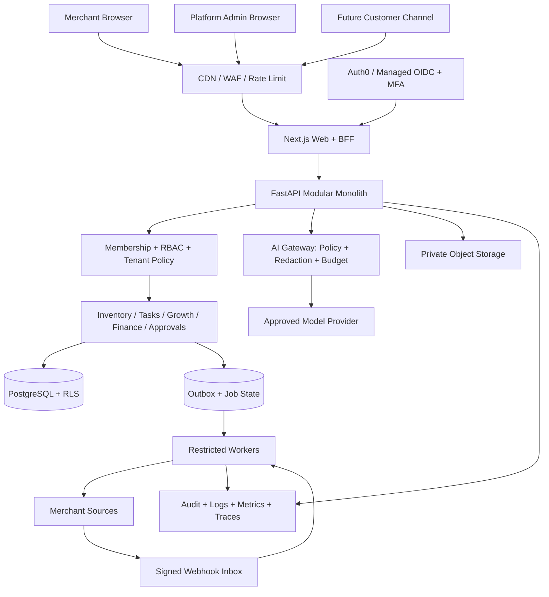

# BizPilot AI — A to Z Product, Architecture, and Delivery Plan

**Document date:** 10 October 2026   
**Status:** Living execution plan. Current implementation and future commitments are kept separate.  
**Canonical supporting documents:** [Production plan](PRODUCTION_PLAN.md), [Commercial product plan](COMMERCIAL_PRODUCT_PLAN.md), [Security requirements](SECURITY_REQUIREMENTS.md), [Role-permission matrix](docs/R1_ROLE_PERMISSION_MATRIX.md), [Threat model](docs/security/R1_THREAT_MODEL.md), and [one-week demo plan](ONE_WEEK_PLAN.md).

---

## 1. এক পাতায় পুরো বিষয়

BizPilot AI হবে Bangladeshi SME merchant-দের জন্য একটি **multi-tenant business operations platform**। Merchant একটি workspace-এ inventory, tasks, growth, finance, approvals এবং Copilot ব্যবহার করবে। আমাদের original 18টি Agent থাকবে specialist capability হিসেবে; user-কে 18টি আলাদা app বা chat window ব্যবহার করতে হবে না।

### Product principle

- **AI interprets and explains; deterministic services own facts and actions.** Stock, money, date, permission এবং state transition LLM হিসাব করবে না।
- **One shared platform, multiple bounded capabilities.** প্রথম version-এ 18টি microservice বা 18টি independent autonomous agent বানানো হবে না।
- **Proposal before action.** Meaningful write আগে exact proposal হবে; authorized human review করার পরে backend execute করবে।
- **Tenant isolation from day one.** Merchant A-এর identity, data, files, jobs, cache বা AI context Merchant B কখনো পাবে না।
- **Progressive delivery.** Inventory এবং Tasks দিয়ে commercial R1; Finance/Growth পরে; HR ও high-risk actions আরও পরে।

### আজকের প্রকৃত অবস্থা

| Area | State | Evidence / limitation |
|---|---|---|
| Local owner demo | **Done** | Streamlit + SQLite, fictional data, Growth/Operations/Finance tools, approval flow, English/Bangla/Banglish |
| Production web foundation | **Done** | Next.js merchant UI, Auth0 BFF session, browser-এ access token যায় না |
| Production API foundation | **Done** | FastAPI, managed OIDC validation, membership and fixed permission checks |
| Multi-tenant database foundation | **Done** | PostgreSQL migrations, tenant keys, restricted runtime roles, default-deny RLS |
| Inventory read | **Done** | Tenant-scoped API and merchant-friendly UI, freshness/source fields |
| CSV import | **Preview foundation** | Template, validation and preview boundary আছে; Apply/write এবং real file pipeline disabled |
| Staging | **Live** | Render web/API + Supabase PostgreSQL + Auth0; free-tier staging only |
| Phase 1H browser security | **In progress** | Auth0 login works; owner membership provisioning এবং full authenticated browser matrix এখনও বাকি |
| Real merchant source | **Not implemented** | Shopify/WooCommerce/POS/CSV source decision এবং production connector বাকি |
| Production Copilot | **Not implemented** | Local prototype agent আছে; multi-tenant AI gateway, usage ledger এবং production tools বাকি |
| 18 production capabilities | **Planned** | Shared foundation ছাড়া 18টি production Agent complete নয় |
| Production operations | **Not complete** | Paid SLA hosting, workers, monitoring, restore drill, DAST, incident response এবং support operation বাকি |

**Honest delivery view:** বর্তমান system একটি strong commercial foundation এবং restricted demo; এটি এখনও real-customer production product নয়।

---

## 2. Product scope ও terminology

### 2.1 Users

| Actor | Meaning | Boundary |
|---|---|---|
| Platform Owner/Admin | BizPilot পরিচালনাকারী আমাদের authorized staff | Merchant role নয়; defaultভাবে merchant business rows দেখতে পারবে না |
| Merchant / tenant | BizPilot ব্যবহারকারী customer business | প্রতিটি merchant-এর isolated workspace |
| Merchant user | Owner বা invited employee | Membership ও role অনুযায়ী access |
| End customer | Merchant-এর shopper/customer | Merchant dashboard বা aggregate business data পাবে না |
| Supplier / vendor | Merchant-কে product সরবরাহকারী business | BizPilot customer বোঝাতে `vendor` ব্যবহার করা হবে না |
| Connection | Shopify, WooCommerce, POS, CSV বা accounting source | Tenant-authorized এবং scoped integration |

### 2.2 Merchant-facing product areas

1. **Home** — priorities, data freshness, exceptions, approvals.
2. **Products & Inventory** — products, variants, locations, stock and imports.
3. **Tasks & Workflow** — assignee, due date, state, recurring workflow.
4. **Customers & Growth** — segments, content and campaign drafts.
5. **Finance & Reports** — clearly defined deterministic summaries.
6. **Copilot** — permitted data ও workflow-এর conversational interface.
7. **Approvals** — exact proposed effect, risk, approver and audit history.
8. **Settings** — business, team, roles, connections, AI policy and billing.
9. **Platform Console** — tenant health, plan, usage and redacted diagnostics; merchant UI থেকে আলাদা।

### 2.3 R1-এর explicit boundary

R1-এ inventory, tasks, one real source, read-only operating summaries, campaign drafts, approvals এবং Copilot থাকবে। Automatic campaign publishing, ad-budget change, supplier payment, refund, payout, recruitment decision অথবা employee scoring থাকবে না।

---

## 3. আমরা কী implement করেছি

### 3.1 Restricted prototype track

- One Streamlit Copilot over fictional SQLite data.
- 12 restricted tools covering inventory, tasks, inactive customers and operational finance.
- Deterministic finance/inventory calculations.
- Actor-bound proposals, confirmation এবং idempotent internal task creation.
- Draft campaign creation; কোনো message send/publish হয় না।
- Input/history/tool/output/cost/deadline bounds.
- Offline mode এবং Gemini/OpenAI provider wiring.
- Bangla, Banglish এবং English evaluation fixtures.
- Backup/restore, load harness, secret/static/dependency checks.

### 3.2 Commercial foundation track: Phase 0–1G

| Phase | Completed output |
|---|---|
| Phase 0 | R1 terminology, first-source decision framework, role-permission matrix, threat model |
| 1A | Deny-by-default authorization model and fixed merchant roles |
| 1B | PostgreSQL tenant schema, restricted roles, transaction-local authority and RLS |
| 1C | Managed OIDC token validation, persistent identity/membership, revocation handling |
| 1D | Tenant inventory schema, read-only API, source/freshness evidence |
| 1E | Bounded CSV validation and import preview; writes disabled |
| 1F | Merchant-friendly Next.js inventory interface |
| 1G | Auth0 browser session/BFF; no access token exposed to browser JavaScript |

### 3.3 Phase 1H staging state

Completed:

- Auth0 staging Regular Web Application এবং API.
- Supabase staging PostgreSQL in Singapore.
- Migrations `0001`–`0004`, restricted runtime and authenticator roles.
- Render staging FastAPI এবং Next.js services.
- HTTPS, CSP, `X-Frame-Options`, `nosniff` এবং signed-out route checks.
- API health check এবং real Auth0 login.
- CI PostgreSQL RLS suite through AWS Public ECR mirror.

Remaining Phase 1H exit work:

1. Auth0 user subject দিয়ে synthetic staging Owner identity/membership provision করা.
2. Authenticated Playwright suite চালানো.
3. Wrong workspace, revoked membership, expired session, logout এবং role-change tests চালানো.
4. Browser/network check করে নিশ্চিত করা যে access token বা secret client-side leak হয়নি.
5. Evidence record update এবং Product Owner checkpoint approval.

### 3.4 Repository map

| Path | Responsibility |
|---|---|
| `app.py`, `agent.py`, `tools/`, `services/` | Restricted Streamlit/SQLite prototype |
| `backend/app/` | FastAPI identity, authorization, membership, inventory and import-preview modules |
| `backend/migrations/` | PostgreSQL tenant/security/inventory schema evolution |
| `backend/sql/roles.sql` | Restricted DB service roles |
| `backend/tests/` | API, authorization, migration and RLS tests |
| `apps/web/` | Next.js merchant UI, Auth0 session and BFF |
| `apps/web/e2e/` | Signed-out and authenticated browser security tests |
| `evals/` | English/Bangla/Banglish regression and holdout cases |
| `docs/decisions/` | Architecture Decision Records |
| `SECURITY_REQUIREMENTS.md` | Every-push and milestone security gates |
| `render.staging.yaml` | Current staging blueprint; not final production infrastructure |

---

## 4. Target architecture

R1 হবে **modular monolith**: deployment কম, shared transactions সহজ, কিন্তু domain boundary পরিষ্কার। Metrics প্রমাণ না করা পর্যন্ত microservice extraction হবে না।

### Request flow

1. Auth0 user authenticate করে; Next.js secure `HttpOnly` session রাখে.
2. BFF API-কে token দেয়; browser JavaScript token পায় না.
3. API signature, issuer, audience, expiry এবং token age validate করে.
4. Database থেকে active identity, membership, role and tenant resolve হয়.
5. Endpoint permission এবং object ownership check করে.
6. Restricted DB role transaction-local tenant context set করে.
7. PostgreSQL RLS দ্বিতীয় isolation layer হিসেবে query filter/deny করে.
8. Write হলে proposal → approval → execution-time recheck → transaction/outbox → audit হয়.
9. AI call হলে minimum tenant-scoped context, redaction, model/cost budget এবং tool policy প্রয়োগ হয়.

### Recommended technology stack

| Layer | Technology | Reason |
|---|---|---|
| Merchant/Admin UI | Next.js, React, TypeScript, Zod, React Hook Form, TanStack Query/Table | Typed, accessible commercial UI এবং server-side BFF |
| API | FastAPI, Pydantic | Typed contracts, async integration এবং current code reuse |
| Data | PostgreSQL, SQLAlchemy 2, Alembic, RLS | Transactions, tenant isolation, migrations |
| Identity | Auth0 managed OIDC; BizPilot-owned membership/RBAC | Password storage avoid; business permission আমাদের control-এ |
| Jobs | PostgreSQL outbox/job table, then Celery + managed Redis | Durable retry/idempotency এবং async imports/sync |
| Files | Private S3-compatible object storage | Quarantine, signed download, lifecycle policy |
| AI | Provider adapter for Gemini/OpenAI; bounded tool runner | Provider flexibility, policy and cost control |
| RAG | `pgvector` only for approved tenant documents | SOP/FAQ retrieval; stock/money-এর source নয় |
| Observability | Structured logs, OpenTelemetry, metrics, error monitoring | Tenant-safe diagnosis and SLO evidence |
| Delivery | Docker, GitHub Actions, managed staging/production | Repeatable build, checks and promotion |

Current Render free services cold-start করতে পারে এবং production SLA দেয় না। Production pilot-এ paid always-on compute, managed backup/PITR, protected secrets এবং alerting লাগবে।

---

## 5. ১৮টি Agent কীভাবে product capability হবে

`Agent` এখানে একটি bounded profile: permitted data, deterministic tools, prompt/evaluation set, budget এবং approval policy। সব capability shared identity, data, audit, connector এবং AI gateway ব্যবহার করবে।

| # | Capability | Merchant value | Required data/tools | Risk | Delivery wave |
|---:|---|---|---|---|---|
| 1 | Marketing Agent | Segment and weekly marketing brief | Customers, orders, consent, campaigns | Medium | Wave 3 |
| 2 | Social Media Agent | Channel-specific draft calendar | Brand policy, catalog, approved assets | High when publishing | Wave 3 draft-only |
| 3 | Content Agent | Product/campaign content drafts | Catalog, brand voice, approved docs | Medium | Wave 3 |
| 4 | Campaign Agent | Segment and campaign proposal | Consent, suppression, segments, results | High when sending | Wave 3 draft-only |
| 5 | SEO Agent | Page/content SEO recommendations | Site/catalog/search data | Medium | Wave 3 |
| 6 | Ads Optimization Agent | Spend/performance recommendation | Ad APIs, attribution, budgets | High financial action | Wave 5 read-only first |
| 7 | Task Manager Agent | Create, assign and track work | Users, tasks, due dates, approvals | Low/Medium | Wave 1 |
| 8 | Workflow Automation Agent | Trigger approved repeatable workflow | Events, rules, job state, idempotency | High if broad tools | Wave 2 |
| 9 | Employee Assistant Agent | SOP and policy Q&A | Approved documents, employee ACL | Sensitive | Wave 4 |
| 10 | Inventory Agent | Stock visibility, alerts, adjustments | Products, variants, locations, movements | Medium | **Wave 1; foundation exists** |
| 11 | Procurement Agent | Reorder recommendation/PO draft | Stock, supplier, lead time, price | High when ordering | Wave 2 draft-only |
| 12 | Appointment Agent | Availability and booking proposal | Calendar, customer, location | Medium | Wave 3/4 |
| 13 | Finance Agent | Deterministic operating summary | Orders, payments, expenses, definitions | High accuracy/privacy | Wave 2 read-only |
| 14 | Cash-flow Agent | Forecast and scenario explanation | Dated cash events, balances, liabilities | High financial accuracy | Wave 2/3 |
| 15 | Invoice/Payment Agent | Invoice follow-up and payment status | Invoice/payment ledger | Critical when moving money | Wave 2 read-only; action later |
| 16 | HR Agent | Policy/admin assistance | Employee records and policy | Highly sensitive | Wave 4 |
| 17 | Recruitment Agent | Job/candidate workflow assistance | Candidate consent and records | Bias/privacy risk | Wave 4 assistive only |
| 18 | Employee Performance Agent | Evidence summary for human review | Goals/work records, appeal process | Very high fairness risk | Wave 5 or defer |

### Capability contract

প্রতিটি capability enable করার আগে নিচের artifact আবশ্যক:

1. User story and non-goals.
2. Data owner, source of truth, freshness and retention.
3. Permission/tool allowlist.
4. Read/proposal/execute risk tier.
5. Deterministic business rules.
6. Prompt and output schema.
7. Injection, authorization and factual evaluation cases.
8. Human approval and rollback rule.
9. Usage/cost budget.
10. Monitoring, incident and disable switch.

---

## 6. Data strategy: current data, updates, RAG and fine-tuning

### 6.1 Source hierarchy

প্রতিটি domain-এ একটিমাত্র declared authoritative source থাকবে। উদাহরণ: Shopify products/orders-এর source; BizPilot internal tasks-এর source। UI-তে source, last sync, last event এবং stale warning দেখা যাবে।

### 6.2 First real source decision

প্রথম merchant-এর বাস্তব workflow দেখে এই priority ব্যবহার করতে হবে:

1. Existing platform API/webhooks থাকলে official connector.
2. Stable database access থাকলে read-only replica/API বা secure local connector; production DB-তে direct write নয়.
3. API না থাকলে staged CSV import.
4. Manual form only for small controlled datasets.

Connector must verify signatures, deduplicate deliveries, tolerate out-of-order events, reconcile periodically, show failure/freshness এবং revoke cleanly।

### 6.3 CSV pipeline

`Upload → quarantine → type/size/row scan → malware scan → deterministic parse → mapping → preview → conflict check → approval → background apply → audit/error report`

Current implementation preview পর্যন্ত foundation দিয়েছে। Production Apply-এর আগে private object storage, malware scanner, conflict/version test, idempotent batch, immutable inventory movement এবং reversal লাগবে।

### 6.4 RAG কখন প্রয়োজন

- RAG লাগবে tenant-approved SOP, return policy, product manual, FAQ বা internal document answer-এর জন্য।
- Stock, price, order, finance, permissions বা approval state SQL/API থেকে আসবে।
- Document/chunk ACL, tenant filter, version, deletion and citation বাধ্যতামূলক।
- Customer-এর local database থাকলেই RAG বাধ্যতামূলক নয়; structured data-এর জন্য connector/ETL/query service সঠিক সমাধান।

### 6.5 Fine-tuning policy

Fine-tuning প্রথম priority নয়। Prompt + tools + retrieval + evaluation দিয়ে measurable gap প্রমাণ হওয়ার পরে only stable, consented, de-identified examples দিয়ে fine-tuning বিবেচনা করা হবে। Customer records training dataset-এ silentভাবে যাবে না।

---

## 7. Identity, roles and administration

### Merchant presets

- **Owner:** settings, team, billing, integrations, reports and high-risk approvals.
- **Admin:** daily workspace administration; ownership transfer নয়.
- **Operations:** inventory, products, locations and tasks.
- **Growth:** segments, content and unsent campaign drafts.
- **Finance Viewer:** authorized finance read/export only.
- **Viewer:** assigned modules read-only.

### Platform roles

- **Platform Owner:** platform configuration and staff access.
- **Platform Operator:** tenant/plan/usage/connection health metadata.
- **Support Agent:** redacted diagnostics; silent impersonation বা default merchant-row access নয়.
- **Security Responder:** alert, session revocation and incident-scoped access.

Platform role এবং merchant role একই authority context-এ combine হবে না। Exceptional support access tenant, ticket, reason, scope, approver এবং expiry-bound হবে; visible banner ও immutable audit থাকবে।

---

## 8. Security and privacy release model

Security একবার শেষে যোগ করা layer নয়। আবার early build বন্ধ করে দেওয়ার মতো uniform gate-ও নয়। `BUILD`, `PILOT`, `PRODUCTION`, এবং feature-specific gates প্রয়োগ হবে।

### Every push

1. Repository policy and secret scan.
2. Static analysis and dependency audit.
3. Unit/integration/authorization tests proportional to change.
4. Tenant negative tests for changed data paths.
5. `git diff --check` and reviewed migration/config diff.
6. No `.env`, token, connection string, customer data or generated database committed.

### Production-blocking controls

- Exact OIDC validation, MFA for privileged roles, secure/revocable sessions.
- Deny-by-default RBAC and execution-time permission recheck.
- Tenant-scoped foreign keys + restricted DB roles + forced/default-deny RLS.
- Two-tenant adversarial tests for API, worker, cache, file, export and RAG.
- CSP, CSRF, origin/host checks, bounds, rate limits and sanitized errors.
- Secrets manager, rotation, environment separation and least privilege.
- Encrypted DB/object backup and measured isolated restore.
- Audit event with actor, tenant, authority, action, target, outcome and source version.
- AI context minimization, prompt-injection tests, tool allowlist and cost limits.
- Incident owner, tenant disable, session revoke and provider/connector kill switch.
- Privacy inventory, consent, retention, export and deletion workflow.

### High-risk features require separate threat review

Payment/refund, procurement order, campaign publishing/bulk messaging, price/ad-budget change, customer-facing identity, HR/recruitment/performance, arbitrary connector URL এবং RAG ingestion কোনো shared “Agent enabled” switch দিয়ে চালু করা যাবে না।

---

## 9. Testing strategy and Definition of Done

### Test pyramid

| Layer | Required evidence |
|---|---|
| Unit | Domain calculations, validation, permissions, state transitions |
| Contract | API schema, provider/connector fixtures, migration compatibility |
| Integration | Real PostgreSQL restricted roles/RLS, outbox, object boundary |
| Security negative | Cross-tenant IDs, revoked role/session, injection, replay, stale approval |
| Browser E2E | Login/logout, session, role UI, direct API attempt, CSP/CSRF |
| AI evaluation | Tool choice, arguments, grounding, refusal, Bangla/Banglish/English |
| Reliability | Retry/idempotency, crash recovery, restore, source outage |
| Performance | p95/p99, queue lag, sync freshness and cost per resolved workflow |

### Feature Definition of Done

A feature “Done” হবে যখন:

- acceptance criteria and non-goals লিখিত;
- permission/data classification assigned;
- code, migration, UI and API reviewed;
- positive and abuse-case tests pass;
- logs contain no secrets/PII beyond policy;
- audit and metrics exist;
- rollback/disable path tested;
- docs/runbook/support notes updated;
- staging evidence accepted by named owner.

Agent response সুন্দর দেখালেই feature Done নয়।

---

## 10. Detailed delivery schedule

নিচের baseline **6–8 person cross-functional team**, one first source এবং timely merchant feedback ধরে। Calendar estimate discovery findings, provider review এবং real data quality অনুযায়ী বদলাবে।

### Stage 0 — Immediate demo completion: 1–2 working days

| Work | Owner | Exit evidence |
|---|---|---|
| Provision staging Owner membership | Backend/Platform | Authenticated inventory API returns only correct tenant |
| Run Phase 1H browser matrix | Frontend + QA | Login/logout/revoke/wrong-tenant/session tests pass |
| Record evidence and approve Phase 1H | Product Owner | Decision/checkpoint updated |

### Stage 1 — Workable merchant demonstration: next 5 working days

| Day | Deliverable | Acceptance |
|---:|---|---|
| 1 | Freeze merchant story, synthetic/sample schema and demo script | Scope, source fields, success questions accepted |
| 2 | Load sanitized sample inventory through controlled staging path | Counts and representative rows verified |
| 3 | Inventory search, low-stock view and task proposal path | No raw DB IDs; exact effect shown |
| 4 | Read-only Copilot answers with source/freshness/evidence | Supported prompts grounded in English/Bangla/Banglish |
| 5 | UX polish, failure states, browser/security regression | Rehearsal passes without manual database editing |
| 6–7 | Buffer, merchant demo and feedback capture | Written feedback and R1 go/no-go |

### Stage 2 — Controlled commercial R1 pilot: 14–18 weeks total

| Weeks | Phase | Main outputs | Exit gate |
|---|---|---|---|
| 1–2 | Discovery and contracts | First merchant/source/channel, data ownership, KPI, DPA needs, UX prototype | Merchant signs scope and sample mapping |
| 2–4 | Platform completion | Phase 1H, environments, MFA policy, tenant lifecycle, team invite, platform/merchant separation | Two-tenant auth matrix passes |
| 4–7 | Inventory vertical | Adjustment ledger, CSV Apply, conflict handling, objects/scanner, audit and reversal | Concurrent/stale/import/recovery tests pass |
| 6–9 | Tasks and approvals | Assignee/state, proposal hash, expiry, recheck, idempotency, outbox | Replay/revoke/crash tests pass |
| 7–11 | First real source | OAuth/credentials, webhook inbox, incremental sync, reconciliation, freshness UI | Source contract and outage tests pass |
| 9–12 | Reports/Growth drafts | Deterministic operating summary, segments, unsent campaign drafts | Finance definitions and consent boundary accepted |
| 10–14 | Production Copilot | AI gateway, tool policy, redaction, usage ledger, evidence links, eval suite | Quality, security and per-workflow cost gates pass |
| 12–16 | Operability | Paid hosting, observability, alerts, backup/PITR, restore/incident drills, DAST | RPO/RTO and incident evidence measured |
| 15–18 | Controlled launch | Shadow mode, limited merchants, staff review, support/runbook and rollback | Merchant signoff and stable monitored pilot |

Parallel work হবে, কিন্তু dependency gate skip হবে না। One engineer হলে R1 24–32+ weeks ধরতে হবে।

### Stage 3 — 18-capability roadmap: 9–15 months after foundation start

| Period | Wave | Capabilities | Release shape |
|---|---|---|---|
| Months 1–4 | Wave 1 | Inventory, Task Manager, core Approvals/Copilot | R1 controlled pilot |
| Months 4–6 | Wave 2 | Workflow, Procurement draft, Finance, Invoice status, Cash-flow foundation | Read/proposal-first; no money movement |
| Months 6–9 | Wave 3 | Marketing, Content, Campaign draft, Social draft, SEO, Appointment | Consent and publishing remain gated |
| Months 9–12 | Wave 4 | Employee Assistant, HR admin, Recruitment assist | Separate sensitive-data review and restricted pilot |
| Months 12–15 | Wave 5 | Ads optimization and Employee Performance; selected external actions | Only if prior evidence supports value and safety |

Full 18-capability scope-এর realistic estimate:

- **6–8 person team:** 9–15 months for staged usable releases; all high-risk actions may still remain proposal-only.
- **3–4 person team:** 15–24 months.
- **1–2 engineers:** 24+ months; capability order আরও narrow করতে হবে.

এই estimate “সব Agent autonomous” promise নয়; customer value, legal review এবং risk অনুযায়ী low-value/high-risk capability defer করা যুক্তিযুক্ত।

---

## 11. Team and resource plan

### Minimum controlled R1 team

| Role | Capacity | Responsibility |
|---|---:|---|
| Product Owner / Merchant SME | 0.5–1 | Scope, workflow, data meaning, acceptance and priority |
| Tech Lead / Backend | 1 | Architecture, API, authorization, domain transactions |
| Frontend Engineer | 1 | Merchant UX, BFF, accessibility, browser security |
| Integration/AI Engineer | 1 | Source connector, AI gateway, evals, usage controls |
| QA Automation | 0.5–1 | Matrix, E2E, regression and release evidence |
| DevOps/SRE | 0.25–0.5 | CI/CD, environments, observability, backup, incidents |
| Security/Privacy reviewer | Fractional per gate | Threat review, DAST, data-processing and launch signoff |
| UX/Product Designer | 0.25–0.5 | Onboarding, inventory/import/approval usability |
| Finance/HR domain advisor | Fractional when relevant | Correct definitions and policy constraints |

একজন person একাধিক role নিতে পারে, কিন্তু Owner, approver এবং implementer accountability লিখিত থাকতে হবে।

### Technical resources

- Separate `dev`, `staging`, `production` Auth0 applications/APIs.
- Separate managed PostgreSQL projects/databases এবং least-privilege credentials.
- Paid always-on web/API/worker hosting in an approved region.
- Managed Redis only when job throughput needs it.
- Private object storage and malware scanning service.
- Domain, TLS, transactional email and optionally SMS/WhatsApp provider.
- Error monitoring, logs/metrics/traces and alert destination.
- Secret manager, dependency/secret scanning, protected CI environments.
- Staging test tenants, sanitized fixtures and dedicated test identities.

### Business and legal resources

- Merchant pilot agreement and named contact.
- Data Processing Agreement and provider/subprocessor review.
- Privacy notice, retention/deletion schedule and consent rules.
- Support hours, incident contact and escalation policy.
- Source-platform developer account/API approval.
- Security review/penetration test budget before wider production.

---

## 12. Cost and capacity planning

Exact provider prices দ্রুত বদলায়; procurement-এর সময় official pricing revalidate করতে হবে। Budget চারটি ledger-এ track হবে:

1. **Platform fixed cost:** web/API/worker, database, cache, object storage, monitoring.
2. **Usage cost:** model tokens, email/SMS/WhatsApp, connector and file scanning.
3. **People cost:** engineering, QA, product, support, domain/security review.
4. **Risk/operation cost:** penetration test, incident response, backup storage and compliance work.

Per tenant metrics:

- active users and workflows;
- database/object growth;
- webhook/job volume and queue lag;
- model calls, input/cached/output tokens and estimated/actual cost;
- channel messages;
- support time;
- gross margin per plan.

Model cost reduction order:

1. SQL/rules for deterministic answers.
2. Only relevant rows/fields in context.
3. Short structured tool results and summaries.
4. Small approved model for routing/extraction; stronger model only when required.
5. Cached stable document chunks/results with tenant/version keys.
6. Per-tenant daily/monthly budget, reservation and hard admission control.

18 capability থাকলেও প্রতি request-এ 18টি model call করা হবে না। Router/policy শুধু প্রয়োজনীয় profile ও tool চালাবে।

---

## 13. CI/CD and environment workflow

### Branch to production

1. Small reviewed change + linked requirement/threat/test.
2. Local proportional tests and security gate.
3. Pull request: lint, secret, dependency, unit, API, real PostgreSQL RLS, web build/E2E.
4. Build immutable image/artifact once.
5. Deploy same artifact to staging; run migration job separately with migration role.
6. Smoke, auth, tenant, security and feature acceptance.
7. Named approval for production environment.
8. Progressive release/feature flag, monitor, rollback if SLO or security gate fails.

### Environment rules

- Secrets never in Git, screenshots, tickets, docs or model prompts.
- Production data never copied into developer machines or test fixtures.
- Staging uses synthetic/sanitized data and separate identities/keys.
- Migration credential never used by runtime service.
- Backup restore happens in isolated environment.
- Releases record commit, artifact digest, migration, config version and approver.

---

## 14. Product metrics and launch gates

### Merchant value metrics

- Inventory exception resolution time.
- Stock accuracy and stale-source rate.
- Task completion/overdue rate.
- Time saved per recurring workflow.
- Copilot grounded-answer success and human correction rate.
- Proposal approval/rejection rate.

### Reliability/security metrics

- Availability and p95 latency by endpoint.
- Job success/retry/dead-letter count and sync freshness.
- Cross-tenant unauthorized result/effect: target **zero**.
- Auth denial and suspicious-rate alert quality.
- Backup success এবং measured restore time.
- High/critical vulnerability remediation age.
- Model/provider cost per resolved workflow.

### Pilot go/no-go

Go only when:

- Phase 1H and two-tenant browser/API matrix pass;
- one real source mapping reconciles correctly;
- enabled writes are idempotent, auditable and reversible where promised;
- backup/restore and incident/rollback drills pass;
- high/critical security findings closed or feature disabled;
- merchant accepts data definitions and workflow;
- support owner and kill switches are ready.

---

## 15. Immediate backlog in exact order

### Now

1. Finish Phase 1H owner membership and authenticated security matrix.
2. Record checkpoint evidence and approve/reject Phase 1H.
3. Execute the one-week merchant demo plan with sanitized sample data.
4. Capture merchant feedback, current system/source and measurable pain point.

### Next R1 foundation

5. Finalize first connector ADR and data contract.
6. Implement tenant onboarding, invitations, MFA policy and workspace switching.
7. Complete inventory adjustment ledger and CSV Apply pipeline.
8. Implement Tasks, Approvals, audit timeline and outbox/worker.
9. Build first connector with webhook inbox, replay safety and reconciliation.
10. Add deterministic reports and draft-only Growth flow.
11. Build multi-tenant AI gateway, usage ledger and evidence-linked Copilot.
12. Add paid production infrastructure, monitoring, backups and runbooks.
13. Run security/restore/load/merchant UAT and controlled pilot.

### After R1 proves value

14. Ship Wave 2 capabilities.
15. Add approved-document RAG if actual use cases need it.
16. Ship Growth capability wave with consent and channel-specific review.
17. Start HR/People discovery under a separate privacy/fairness gate.
18. Consider external financial/publishing actions only after proposal-only evidence.

---

## 16. Teammate onboarding checklist

### First day

1. Read this document and the accepted role/threat/security documents.
2. Run the supported local checks; do not copy production secrets/data.
3. Trace one request: browser → BFF → FastAPI → permission → DB/RLS.
4. Review one cross-tenant denial test and one proposal/approval test.
5. Learn the distinction between prototype Streamlit track and commercial Next.js/FastAPI track.

### Before taking a ticket

- Identify tenant-owned data and required permission.
- Link applicable `SEC-*` requirement and `TM-*` threat.
- State source of truth and failure behavior.
- Define positive, denied and cross-tenant tests.
- Confirm whether action is read, proposal or execute tier.

### Before opening a PR

- Run relevant tests and security gate.
- Review migrations and logs for data/secret leakage.
- Update docs/ADR/runbook when contract or architecture changes.
- Include evidence, limitations and rollback path in PR description.

---

## 17. Decisions still needed from Product Owner

| Decision | Needed by | Why |
|---|---|---|
| First pilot merchant and authoritative source | Before R1 week 1 | Connector and schema depend on it |
| First user/channel: owner dashboard only or one customer channel | Discovery | Identity, consent and support scope differ |
| Pilot data classes allowed in staging/model | Before real data | Provider/privacy review |
| Production hosting region and budget | Before weeks 12–16 | SLA, residency, backup and cost |
| Pilot success metrics and number of merchants | Discovery | Determines capacity and acceptance |
| Support hours and incident owner | Before launch | Operational readiness |
| Finance definitions/accounting boundary | Before Finance release | Prevents misleading claims |
| HR capability priority | After R1 | Requires separate legal/privacy/fairness review |

---

## 18. Final delivery commitment

- **1–2 days:** close Phase 1H if identity provisioning and tests reveal no blocker.
- **1 week:** demonstrate one safe, usable merchant inventory/Copilot vertical slice.
- **14–18 weeks:** controlled R1 pilot with one real source and limited merchants, given the stated team and timely access.
- **9–15 months:** staged delivery of the 18-capability roadmap with a 6–8 person team; high-risk actions remain evidence-gated.

The team should sell the result that is actually operating: trustworthy data, understandable workflow, explicit control and measurable time saved। Agent count alone commercial value বা production readiness প্রমাণ করে না।

---

