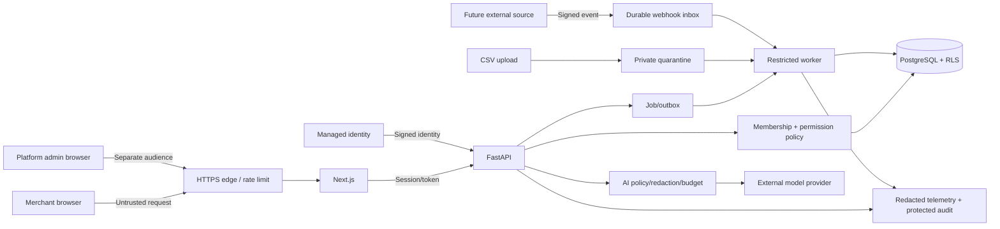

# BizPilot Commercial R1 Threat Model

**Version:** 0.1
**Date:** 2026-10-08
**Status:** Accepted for Phase 1 implementation on 2026-10-08; update whenever identity, tenant scope, files, connectors, exports, external actions, finance, RAG, or deployment boundaries change.

## 1. Scope

This threat model covers the planned R1 merchant web application, separate platform operations surface, FastAPI backend, managed identity, PostgreSQL tenant data, Redis/job processing, private object storage, CSV inventory import, bounded AI provider calls, audit/telemetry, and deployment pipeline.

The current Streamlit/SQLite demo remains synthetic and outside the real-data production boundary. Payment/refund, external campaign sending, procurement, HR, RAG, and a committed API connector are disabled until separate feature threat reviews pass.

## 2. Security objectives

1. One merchant cannot read, infer, change, export, retrieve, or trigger actions in another merchant.
2. A user/service can perform only operations granted by current tenant-scoped authority.
3. Secrets, tokens, customer data, business-sensitive records, and raw model/provider errors do not leak through source, UI, logs, support, files, or model context.
4. Inventory imports and actions remain attributable, conflict-aware, transactional, idempotent, and recoverable.
5. AI content cannot grant authority or directly execute an unvalidated action.
6. Abuse by one user/tenant/provider cannot create uncontrolled cost or deny service to others.
7. Incidents can be detected, contained, investigated, and recovered from using trustworthy evidence.

## 3. Assets

| Asset | Impact if compromised |
|---|---|
| Tenant identity and memberships | Cross-tenant access or role escalation |
| Sessions, tokens, connector credentials, model keys | Account/source takeover and data/cost abuse |
| Product, inventory, task, customer, order, finance data | Confidentiality loss, wrong business decisions, fraud |
| Proposals, approvals, idempotency records | Unauthorized or repeated business actions |
| CSV files and import results | Malware/injection path, corruption, cross-tenant disclosure |
| Audit/security evidence | Attacker concealment or false incident conclusions |
| Backups and object storage | Large-scale offline data disclosure or failed recovery |
| Model prompts/context/results | Data leakage, prompt injection, misleading actions |
| Build pipeline and artifacts | Supply-chain compromise across all tenants |
| Availability and usage budget | Business interruption and unexpected provider cost |

## 4. Actors

- legitimate Merchant Owner/Admin/Operations/Growth/Finance Viewer/Viewer;
- legitimate Platform Owner/Operator/Support/Security Responder;
- anonymous internet attacker;
- malicious or compromised merchant user;
- malicious tenant attempting cross-tenant access or resource exhaustion;
- compromised browser/session/device;
- malicious CSV/document content;
- compromised connector/source or forged webhook;
- compromised dependency, CI account, build action, or artifact;
- model/provider returning incorrect, hostile, or overbroad output;
- accidental operator/developer error.

## 5. Trust boundaries and data flow

Every arrow crossing a component is untrusted until authenticated/validated for that boundary. Internal network location does not grant authority.

## 6. Risk scale

- **Critical:** plausible cross-tenant/large secret compromise or unauthorized high-value action; release blocked.
- **High:** significant data/action/availability impact; enabled path blocked until fixed or materially mitigated.
- **Medium:** limited impact or difficult exploitation; owner and dated mitigation required for pilot.
- **Low:** minor hardening/usability issue; normal backlog unless combined with other weaknesses.

## 7. Threat register

| ID | Threat / abuse case | Inherent risk | Required controls | Verification / release rule |
|---|---|---:|---|---|
| `TM-01` | Change tenant/object ID to access another merchant | Critical | Verified active tenant, endpoint object checks, tenant-scoped keys, restricted runtime role, PostgreSQL RLS/default deny | Two-tenant API/repository/worker/cache/export/object tests; any result blocks production |
| `TM-02` | Account/session takeover | High | Managed auth, MFA for privileged roles, secure cookies, token validation/rotation/revocation, rate limiting, risk reauthentication | Expired/wrong issuer/audience/revoked/session fixation/recovery tests |
| `TM-03` | Merchant user escalates role or uses hidden endpoint | High | Server-side permission policy, deny by default, protected membership changes, execution-time recheck | Matrix tests for every role and direct API invocation |
| `TM-04` | Platform staff silently reads merchant data | High | Separate platform audience/routes, metadata-only support, approved expiring support session, no mutation, protected audit | Support access/expiry/revocation tests and periodic access review |
| `TM-05` | API/connector/model/database secret leaks | Critical | Managed secret store, environment/scope separation, redacted errors/logs, rotation/revocation, repository/history scans | Every-push scan, log tests, rotation drill; exposure blocks release and triggers rotation |
| `TM-06` | SQL/command/template/path injection | High | Typed input, allowlists/bounds, parameterized SQL, no shell with untrusted input, path confinement, output encoding | Unit/integration fuzz/negative tests, Ruff/Bandit, targeted DAST |
| `TM-07` | Stored/reflected XSS or CSRF changes data | High | Context encoding, CSP/security headers, secure SameSite cookies, CSRF tokens/origin checks, no unsafe HTML | Browser tests and DAST before production |
| `TM-08` | Malicious/oversized CSV exhausts or compromises parser | High | CSV-only, allowlisted MIME/extension, size/row/field/decompression bounds, quarantine, malware scan, no macros/formulas, background parse | Malformed, formula, encoding, zip-bomb/oversize, cross-tenant file tests before upload enabled |
| `TM-09` | Stale CSV overwrites newer stock | High | Staged preview, expected record version/current value, conflict rows, transactional apply, immutable movements, reversal | Concurrent import/edit tests; silent overwrite blocks feature |
| `TM-10` | Duplicate/replayed job/action changes data twice | High | Idempotency key, unique constraint, transaction/outbox, execution state, replay-safe result | Crash-before/after-commit and concurrent confirmation tests |
| `TM-11` | Model or retrieved content causes unauthorized tool call | High | Model has no authority, backend tool allowlist, tenant/role validation, structured arguments, exact approval, no arbitrary code | Prompt-injection/adversarial tests; unauthorized effect blocks AI feature |
| `TM-12` | Sensitive tenant data leaks to model provider | High | Tenant-approved provider/policy, minimal projection, field redaction, no secrets, no silent fallback, retention/terms review | Payload inspection tests and provider configuration review |
| `TM-13` | Model invents stock, money, date, or completed action | High | Deterministic domain calculations, evidence/source/freshness, state lookup, explicit proposal/action status | Grounded evals and exact deterministic comparison |
| `TM-14` | Forged/duplicate/out-of-order future webhook corrupts data | High | Raw-body HMAC/signature verification, delivery dedupe, event/source timestamps, idempotent processing, reconciliation | Provider contract fixtures; connector disabled until pass |
| `TM-15` | Connector token has excessive scope or tenant mix-up | Critical | Least scopes, tenant binding, encrypted secret, separate connection IDs, source ownership checks, revoke/disconnect | Cross-tenant and wrong-account connector tests; any mix-up blocks connector |
| `TM-16` | One tenant/user causes denial of service or cost spike | High | Per-identity/tenant/IP rate limits, bounded imports/results/jobs/model calls, quotas, fair queues, admission control | Burst/large-input/provider-delay tests and cost alerts |
| `TM-17` | Logs/errors/analytics expose PII or secrets | High | Structured allowlisted telemetry, redaction, sanitized errors, restricted retention/access, no raw prompts by default | Log capture tests for failure paths and periodic sampling |
| `TM-18` | Dependency/CI/build compromise | High | Locked/minimal dependencies, scans, minimal workflow token, protected secrets/environments, reviewed actions, container scan/SBOM later, immutable promotion | CI gates and release artifact evidence |
| `TM-19` | Backup/object copy leaks or cannot restore | High | Encryption, separate credentials, restricted access, database + object backup, isolated restore test, retention/deletion | Timed restore and access tests before real-data production |
| `TM-20` | Privileged action is approved with changed/stale payload | Critical for high-risk; High for R1 | Approval binds tenant/actor/action/payload hash/source/policy/expiry; recheck current permission and state | Mutation/expiry/revocation/concurrent approval tests |
| `TM-21` | SSRF through future connector URL/webhook callback/import reference | High | Provider allowlist, URL parsing, DNS/IP controls, block metadata/private destinations, controlled egress | SSRF test suite before arbitrary source URLs enabled |
| `TM-22` | Deletion/export misses cache, object, queue, or search copy | High | Data inventory, scoped export, deletion workflow/tombstone, downstream propagation and audit | End-to-end export/deletion tests before those rights are offered |

## 8. Abuse stories that become tests

1. A Tenant A Operations user replaces an inventory ID with Tenant B's ID in the request.
2. A Viewer calls the inventory-adjust endpoint directly even though the button is hidden.
3. An Admin approves a proposal, loses the role, then tries to execute the old approval.
4. Two users approve the same proposal simultaneously.
5. A merchant uploads an old CSV after a sale/manual adjustment changed the quantity.
6. A CSV cell begins with `=`, `+`, `-`, or `@` and later appears in an export.
7. A file claims `text/csv` but contains an unsupported/binary payload or excessive field/row length.
8. A prompt or product description says to ignore policy and retrieve another tenant's data.
9. A provider error contains a request URL/token and reaches the UI/log pipeline.
10. A worker receives a crafted job payload with another tenant ID.
11. A support agent attempts tenant record access without or after expiry of a support grant.
12. A model/provider times out after an external request; retry must reconcile before repeating it.

## 9. Security controls required by milestone

### Before production foundation code is merged

- permission identifiers and role matrix accepted;
- tenant ID present in all proposed tenant-owned schemas and relationships;
- managed identity boundary and Platform Admin separation designed;
- threat-model-linked negative tests included with each implemented boundary;
- existing BUILD push gate stays green.

Phase 1B now implements the proposed PostgreSQL tenant keys, separate platform
staff table, restricted runtime role, transaction-local authority context, and
default-deny RLS policies. Offline migration checks and the real PostgreSQL
two-tenant suite passed against a disposable local database. GitHub Actions run
`37764800681` repeated the PostgreSQL suite and passed the Windows security/test
job and Linux Docker build before the checkpoint was closed.

Phase 1C adds fixed-algorithm managed OIDC verification, a restricted
authenticator database role, server-side identity and membership resolution,
and per-request revocation checks. The browser's active-tenant header is only a
selector. A valid token plus an exact active database membership is required.
Identity suspension, membership revocation, or `tokens_valid_after` invalidates
access on the next protected request. Denial telemetry contains a category and
server correlation ID without tokens, subjects, tenant IDs, or provider/database
payloads.

Phase 1D adds tenant-owned products, variants, balances, and movement-ledger
foundations with composite tenant foreign keys and forced RLS. The API runtime
has read-only inventory/location privileges. The inventory endpoint requires
both current Phase 1C authority and `inventory.read`, bounds pagination, and
returns source observation/version metadata. CSV upload, staging, apply, and
all inventory writes remain disabled until their feature gates pass.

### Before any real CSV is accepted

- upload feature requirements `SEC-INP-005` to `SEC-INP-007` pass;
- `SEC-ACT-006` staged import/conflict/audit passes;
- tenant file/object isolation and short-lived downloads pass;
- data-processing/retention agreement and sanitized support process exist;
- backup/restore covers imported state and files;
- current Streamlit demo is not the upload target.

### Before shared multi-tenant pilot

- `SEC-TEN-001` through `SEC-TEN-010` pass using real PostgreSQL runtime roles;
- managed identity, MFA for privileged roles, session revocation, and role-change tests pass;
- two-tenant adversarial suite shows zero unauthorized results/actions;
- monitoring and tenant-disable/incident runbooks work;
- staging DAST and high/critical finding review complete.

### Before a connector is enabled

- connector is selected through ADR 0002 validation gate;
- exact scopes/data ownership/uninstall behavior documented;
- credential, webhook, replay, deletion, outage, and reconciliation tests pass;
- stale/failed/revoked connection state is visible and blocks unsafe commitments.

## 10. Deferred reviews

Create separate threat-model sections before enabling:

- customer-facing identity/order lookup;
- campaign sending and consent/suppression;
- payment, refund, invoice, and payout operations;
- procurement and supplier credentials;
- RAG/file knowledge ingestion;
- HR, recruitment, or employee performance data;
- mobile app or local/on-premise connector;
- custom tenant roles, enterprise SSO/SCIM, or dedicated tenant deployments.

## 11. Ownership and review cadence

The backend/platform owner maintains tenant/auth/data-flow threats. The frontend owner maintains browser/session/upload threats. The integration/AI owner maintains connector/model threats. Product owns enabled-feature boundaries and merchant consent. A named incident owner is required before production.

Review this document:

- when a trust boundary or protected data class changes;
- before enabling any feature listed in Deferred reviews;
- after a security incident or material penetration-test finding;
- at least once per release milestone during R1.
