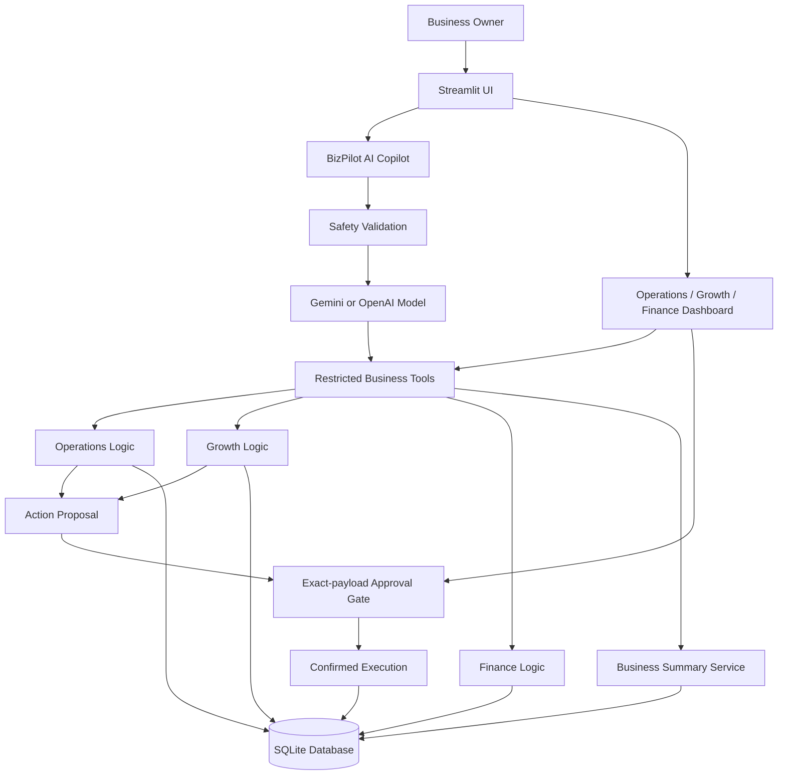

# BizPilot AI — Project Overview

## 1. Project Purpose

**BizPilot AI** is an **AI Business Operations Copilot** designed for small and medium-sized businesses in Bangladesh.

A business owner can use one place to find out:

- Which products are low in stock
- Which tasks are pending
- Which customers have not made a purchase recently
- Today's order-cohort sales, recorded receipts, receivables, and dated expenses
- Which tasks should be prioritized today

Users can ask questions in English, Bangla, or Banglish. For example:

- `kon product stock kom?`
- `30 din dhore kichu kine nai emon customer dekhao`
- `ajker sales koto?`
- `ajke amar ki ki kora uchit?`

---

# 2. What Has Been Implemented

## AI Copilot

A central **AI Copilot** has been created. It understands the user's question and calls the required business tools.

The Copilot currently:

- Understands English, Bangla, and Banglish
- Maintains bounded recent conversation history
- Does not invent business data
- Retrieves verified information from the database with source and query-time evidence
- Can use either a Gemini or OpenAI model
- Can run in a limited `offline` mode without an API

The Gemini adapter is implemented and covered with fake-provider tests. A live Gemini quality run is a Day 3 gate and has not yet been counted as passed.

Main file: [agent.py](E:/Github/ai-agent/ai-agent-business/agent.py)

---

## Operations Module

The Operations section includes:

- Viewing inventory
- Searching by product name, size, and color
- Identifying low-stock products
- Viewing pending tasks
- Proposing new internal tasks for owner confirmation
- Proposing restock review tasks for low-stock products
- Preventing duplicate open restock tasks for the same product

Example:

```text
black XL stock ase?
```

The Copilot first calls the inventory tool and then displays the verified stock quantity.

Files:

- [operations.py](E:/Github/ai-agent/ai-agent-business/tools/operations.py)
- [inventory_workflow.py](E:/Github/ai-agent/ai-agent-business/workflows/inventory_workflow.py)

---

## Growth Module

The Growth section includes:

- Finding customers who have been inactive for 7, 30, or 60 days
- Creating customer segments
- Proposing re-engagement campaign briefs for owner confirmation
- Creating English and Banglish campaign messages
- Saving campaigns as drafts in the database

No message is actually sent or published.

File: [growth.py](E:/Github/ai-agent/ai-agent-business/tools/growth.py)

---

## Finance Module

The Finance section includes:

- Sales calculation
- Expense calculation
- Receipts recorded on orders in the selected date range
- Receivable on that order cohort
- Dated expense calculation
- Financial reports filtered by date range

Current formulas:

```text
Order-cohort receivable = Confirmed/Delivered Sales - Receipts recorded on those orders
Operating comparison = Order-cohort receipts - Dated expenses
```

Financial calculations are not performed by the AI model. All calculations are performed deterministically with **Python and SQL**. This is not period cash flow: payment-event dates, opening balance, refunds, fees, and a complete receivables ledger are not modeled.

File: [finance.py](E:/Github/ai-agent/ai-agent-business/tools/finance.py)

---

## Business Priority Summary

A combined summary service has been created.

If the user asks:

```text
ajke amar ki ki kora uchit?
```

The Copilot collects:

- Low-stock products
- High-priority tasks
- Inactive customers
- Today's financial summary

The configured model then uses the verified data to create a prioritized list. In offline mode, a deterministic formatter produces the limited demo reply.

File: [business_summary.py](E:/Github/ai-agent/ai-agent-business/services/business_summary.py)

---

## Streamlit Dashboard

The application's user interface was built with **Streamlit**.

The dashboard has five tabs:

1. **AI Copilot**
2. **Operations**
3. **Growth**
4. **Finance**
5. **Approvals**

Users can chat while also using tables, metrics, and workflow buttons.

File: [app.py](E:/Github/ai-agent/ai-agent-business/app.py)

---

# 3. Project Architecture



## How the Architecture Works

### Step 1: The User Asks a Question

Example:

```text
kon product stock kom?
```

### Step 2: The Copilot Understands the Question

Gemini recognizes that this is an inventory-related question.

### Step 3: It Selects the Correct Tool

The Copilot calls the `low_stock_items` tool.

### Step 4: The Python Tool Queries the Database

The tool reads the actual inventory quantity and threshold from the SQLite database.

### Step 5: The Verified Result Is Returned to the Model

Gemini explains the verified result in simple language.

This design grounds stock and financial figures in tool results and reduces hallucination risk. It does not guarantee that every sentence generated by a model is correct, so evaluation and evidence remain necessary.

---

# 4. Database Architecture

The project currently uses a local **SQLite database**.

The main database tables are:

| Table | Purpose |
|---|---|
| `customers` | Customer information |
| `products` | Product information |
| `inventory` | Size, color, quantity, and stock threshold |
| `orders` | Order value, status, and received amount |
| `expenses` | Business expenses |
| `tasks` | Pending and completed internal tasks |
| `campaigns` | Draft marketing campaigns |
| `action_proposals` | Actor-bound normalized write proposals awaiting confirmation |
| `action_executions` | Idempotent execution status and result ledger |
| `audit_events` | Actor/action/outcome audit metadata without payload text |
| `ai_usage` | Persistent model-run reservation and usage accounting |

Database initialization:

- [db.py](E:/Github/ai-agent/ai-agent-business/database/db.py)
- [seed.py](E:/Github/ai-agent/ai-agent-business/database/seed.py)

The project currently uses fictional demonstration data.

---

# 5. AI Integration

The project supports three AI modes.

| Mode | Purpose |
|---|---|
| `gemini` | Model-generated responses through the Gemini API |
| `openai` | Responses through the OpenAI API |
| `offline` | Rule-based demonstration responses without an API |

Configuration is loaded from the `.env` file:

```env
BIZPILOT_AI_MODE=gemini
GEMINI_API_KEY=your-private-key
GEMINI_MODEL=gemini-3.1-flash-lite
```

The integration uses Gemini's **OpenAI-compatible Chat Completions endpoint**. This makes it possible to use Gemini while keeping the same OpenAI Agents SDK agent and tool architecture.

Configuration file: [config.py](E:/Github/ai-agent/ai-agent-business/config.py)

---

# 6. Agent Tools

The Copilot has 12 restricted tools:

### Operations Tools

- `inventory_lookup`
- `low_stock_items`
- `create_internal_task`
- `pending_tasks`
- `create_restock_review_tasks`

### Growth Tools

- `inactive_customers`
- `draft_reengagement_campaign`

### Finance Tools

- `sales_summary_for_dates`
- `expense_summary_for_dates`
- `today_financial_summary`
- `financial_summary_for_dates`

### Combined Tool

- `business_priorities`

The Copilot does not have access to dangerous capabilities such as:

- Price changes
- Refunds
- Money transfers
- Order deletion
- Customer deletion
- Inventory purchasing
- Campaign publishing

---

# 7. Safety Implementation

Safety does not depend only on the prompt.

Multiple layers are used:

1. **Pre-model validation**
   Dangerous requests are blocked before the model is called.

2. **Restricted tool list**
   The agent can call only approved tools.

3. **Pydantic validation**
   Task priority, category, and campaign inputs are validated.

4. **Database constraint**
   A unique index prevents duplicate open restock tasks.

5. **Owner confirmation and idempotency**
   Enabled writes first create an actor-bound, exact-payload proposal. Confirmation is re-authorized and replay-safe.

6. **Bounded model execution**
   Input, history, tool results, calls, output tokens, deadline, concurrency, and daily budget are limited and recorded.

7. **No destructive tools**
   Refund, deletion, transfer, and price-update functions have not been implemented.

Example:

```text
change all product price to 1 taka
```

This request is refused immediately, and no data is changed.

---

# 8. Technology Stack

| Technology | Purpose |
|---|---|
| **Python 3.11+** | Main backend language |
| **Streamlit** | Web UI and chat interface |
| **SQLite** | Local relational database |
| **OpenAI Agents SDK** | Agent orchestration and tool calling |
| **Gemini API** | Current AI model provider |
| **OpenAI API** | Alternative model provider |
| **Pydantic** | Input validation |
| **python-dotenv** | `.env` configuration loading |
| **pytest** | Automated testing |
| **PowerShell** | Windows setup and launcher |
| **SQL** | Business data queries and aggregation |

---

# 9. Testing and Current Status

At the Day 2 local pilot-hardening checkpoint, **44 automated tests pass**.

Test coverage includes:

- Inventory filtering
- Low-stock calculation
- Finance calculation
- Invalid date ranges
- Customer inactivity
- Campaign drafts
- Task validation
- Duplicate restock prevention
- Database seed idempotency
- Offline mode
- Gemini configuration
- Dangerous action blocking
- Pilot authentication and allowlist denial
- Demo/pilot data-mode behavior
- Bounded results and dataset evidence
- Correct order-cohort finance terminology
- Model and tool-call bounds, timeout and persistent daily budget admission
- Proposal confirmation, replay, payload tampering, failure and concurrency
- Streamlit evidence labels, numeric cards and confirmation UI
- Backend-dated “today” finance without a model-generated date

Tests: [tests](E:/Github/ai-agent/ai-agent-business/tests)

Command to run the application:

```powershell
powershell -ExecutionPolicy Bypass -File .\run.ps1
```

The launcher:

1. Creates the virtual environment
2. Installs dependencies
3. Creates `.env`
4. Initializes the demo database
5. Runs the automated tests
6. Starts the Streamlit server

Launcher file: [run.ps1](E:/Github/ai-agent/ai-agent-business/run.ps1)

---

# 10. Current Limitations

This is still a local MVP. Current limitations include:

- Only one fictional business workspace
- Pilot OIDC and issuer/subject authorization are implemented, but the real Google client/callback is not configured or browser-tested yet
- No multi-tenant support
- No connection to a real inventory system
- No real order source
- No payment gateway integration
- No WhatsApp, Messenger, or SMS integration
- Campaigns are not actually sent
- No background scheduler
- No production deployment
- It is not a formal accounting system
- Local API keys use `.env`; deployed secrets must use the host secret manager
- Live Gemini multilingual quality, deployed persistence, restore and rollback remain Day 3 gates

---

# 11. Future Directions

## Phase 1: Production-Ready Foundation

- Migrate from SQLite to **PostgreSQL**
- Add user authentication
- Add role-based access control
- Add multi-tenant business support
- Add secure secret management
- Add audit logs
- Add a database migration system

## Phase 2: Real Business Integrations

- Shopify or WooCommerce order synchronization
- POS integration
- Inventory management integration
- Payment gateway integration
- Facebook and WhatsApp Business integration
- Accounting software integration

## Phase 3: Automation

- Scheduled daily business summaries
- Automatic low-stock alerts
- Inactive customer detection jobs
- Campaign approval workflows
- Email, SMS, or WhatsApp notifications
- Background job processing

Possible technologies:

- Celery or RQ
- Redis
- APScheduler
- Message queues

## Phase 4: Improved AI System

- Expanded Bangla and Banglish evaluation
- Explicit provider outage handling without silent fallback
- Streaming responses
- Conversation memory
- Retrieval-Augmented Generation, or **RAG**
- Business policy knowledge base
- Expand the existing human approval gate to any future sensitive action
- Tool-call observability
- Token and cost monitoring

## Phase 5: Analytics

- Sales trend charts
- Product performance
- Customer retention
- Expense categories
- Cash-flow forecasting
- Demand forecasting
- Business anomaly detection

## Phase 6: Deployment

- Docker containers
- Cloud deployment
- Managed PostgreSQL
- HTTPS
- Monitoring and error tracking
- Automated CI/CD pipeline
- Backup and disaster recovery

---

# Summary

We have created a working local MVP in which:

- Business owners can ask questions in natural language
- Gemini understands the question and calls restricted tools
- Business facts come from SQLite
- Python and SQL perform financial and inventory calculations
- Streamlit displays results through a dashboard and chat interface
- System-level safety blocks dangerous actions
- All 44 deterministic automated tests pass

The next major steps are **real business data integration, authentication, PostgreSQL, background automation, and production deployment**.
